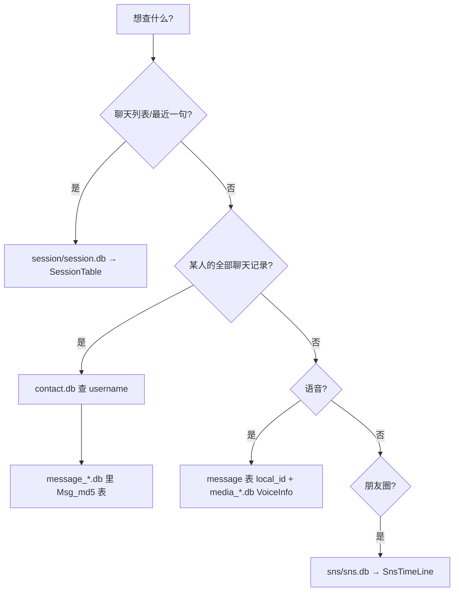

# 微信 4.x 解密后数据库速查说明

> 基于 [wechat-decrypt](https://github.com/ylytdeng/wechat-decrypt) 整理，适用于 macOS / Windows / Linux 上 **微信 4.x** 本地库解密后的查阅与 SQL 查询。

---

## 一、整体目录结构

解密结果一般在项目里的 `decrypted/` 目录（`config.json` 中的 `decrypted_dir`），目录结构与原始 `db_storage/` 一一对应：

```
decrypted/                    ← 解密输出根目录
├── session/session.db        ← 会话列表（聊天列表）
├── contact/contact.db        ← 联系人 / 群 / 标签
├── message/message_0.db      ← 聊天记录（按容量分片）
├── message/message_1.db
├── ...
├── media_0/media_0.db        ← 语音二进制、媒体索引（也可能有 media_1…）
├── head_image/head_image.db  ← 头像缓存索引
├── favorite/favorite.db      ← 收藏
├── sns/sns.db                ← 朋友圈
├── emoticon/emoticon.db      ← 表情包
└── （其它）bizchat、hardlink、general、function 等辅助库
```

### 核心概念

| 概念 | 说明 |
|------|------|
| 一个会话 | 用 `username` 标识，如 `wxid_xxx` 或 `xxx@chatroom`（群） |
| 消息表名 | 每个会话对应一张表：`Msg_<md5>`，`md5` 由 `username` 算出 |
| 消息分片 | 同一会话的消息可能分布在 `message_0.db`、`message_1.db`… 多个文件里 |
| 媒体实体 | `.db` 里多是索引/二进制；图片 `.dat`、文件多在账号目录的 `msg/attach` 等路径 |

### 消息表名计算（Python）

```python
import hashlib

username = "wxid_xxxxxxxx"  # 或 xxx@chatroom
table = "Msg_" + hashlib.md5(username.encode()).hexdigest()
```

---

## 二、最常查的 4 个库

### 1. `session/session.db` — 聊天列表 / 最近一条摘要

**用途：** 看谁最近聊过、最后一条说了什么、未读数、排序。

**主表：** `SessionTable`

| 字段（常用） | 含义 |
|-------------|------|
| `username` | 会话 ID（好友 wxid 或 `xxx@chatroom`） |
| `unread_count` | 未读条数 |
| `summary` | 最新消息摘要（有时是 zstd 压缩的 BLOB） |
| `last_timestamp` | 最后消息时间（Unix 秒） |
| `last_msg_type` | 消息类型码（1 文本、3 图、34 语音…） |
| `last_msg_sender` | 群聊里最后发言人的 wxid |
| `last_sender_display_name` | 最后发言人显示名 |

**示例 SQL：**

```sql
-- 最近 20 个会话
SELECT username, unread_count, last_timestamp, last_msg_type
FROM SessionTable
WHERE last_timestamp > 0
ORDER BY last_timestamp DESC
LIMIT 20;
```

---

### 2. `contact/contact.db` — 联系人 / 备注 / 群成员信息

**用途：** 把 `wxid` 转成备注名、昵称；搜人；查标签。

**主表：** `contact`

| 字段（常用） | 含义 |
|-------------|------|
| `username` | wxid 或群 ID |
| `nick_name` | 昵称 |
| `remark` | 备注名（优先用于显示） |
| `alias` | 微信号 |
| `description` | 签名等 |
| `phone` | 电话（若有） |

**其它可能存在的表：** `contact_label`（联系人标签）、群相关表等——用 `.tables` 查看。

**示例 SQL：**

```sql
-- 按备注/昵称搜索
SELECT username, nick_name, remark, alias
FROM contact
WHERE remark LIKE '%张三%' OR nick_name LIKE '%张三%'
LIMIT 20;
```

---

### 3. `message/message_*.db` — 完整聊天记录（最大、最重要）

**用途：** 查某个好友/群的全部消息正文。

**表命名：** 每个会话一张表 `Msg_<md5(username)>`（见上文 Python 片段）。

**消息表常见字段：**

| 字段 | 含义 |
|------|------|
| `local_id` | 库内消息 ID（导出/语音解码会用到） |
| `create_time` | 发送时间（Unix 秒） |
| `local_type` | 消息类型（见下表） |
| `message_content` | 正文或 XML（链接、文件、转账等多为 XML） |
| `WCDB_CT_message_content` | 压缩类型；非 0 时内容可能是 zstd 压缩 |
| `real_sender_id` | 群聊真实发送者（需配合 `Name2Id`） |

**`local_type` 常见值：**

| 值 | 类型 |
|----|------|
| 1 | 文本 |
| 3 | 图片 |
| 34 | 语音 |
| 42 | 名片 |
| 43 | 视频 |
| 47 | 表情 |
| 48 | 位置 |
| 49 | 链接 / 文件 / 小程序等（多为 XML） |
| 50 | 语音/视频通话 |
| 10000 | 系统消息 |
| 10002 | 撤回 |

**每个 `message_N.db` 里还有：**

- `Name2Id`：把数字 ID 映射到 `user_name`（群成员解析用）

**示例 SQL：**

```sql
-- 列出该库中所有聊天表
SELECT name FROM sqlite_master
WHERE type='table' AND name LIKE 'Msg_%';

-- 查某会话最近 50 条（将 Msg_xxx 换成实际表名）
SELECT local_id, create_time, local_type, message_content
FROM Msg_xxxxxxxxxxxxxxxxxxxxxxxxxxxxxxxx
ORDER BY create_time DESC
LIMIT 50;
```

**跨分片：** 若 `message_0.db` 没有目标表，继续查 `message_1.db`、`message_2.db`… 仓库的 `export_chat.py` / Web UI 会自动扫全部分片。

---

### 4. `media_0/media_*.db` — 语音与媒体索引

**用途：** 取语音的 SILK 二进制、查媒体元数据；**不是**聊天文字的主库。

**常用表：** `VoiceInfo`

| 字段 | 含义 |
|------|------|
| `chat_name_id` | 对应 `Name2Id` 里的 rowid |
| `create_time` | 与消息时间对应 |
| `voice_data` | SILK 语音二进制（需转 WAV/MP3） |
| `local_id` | 与消息表 `local_id` 对应 |

**示例 SQL：**

```sql
.schema VoiceInfo

SELECT local_id, create_time, length(voice_data) AS bytes
FROM VoiceInfo
ORDER BY create_time DESC
LIMIT 10;
```

图片/文件路径多在消息 XML 或 `msg/attach` 目录，不单靠这个库。

---

## 三、其它库（按需查阅）

| 路径 | 主要内容 | 何时用 |
|------|----------|--------|
| `sns/sns.db` | 表 `SnsTimeLine`（朋友圈 XML）、评论/点赞相关表 | 查朋友圈文字；图片在缓存目录，可用 `export_sns.py` |
| `favorite/favorite.db` | 收藏的文章、链接等 | 找「收藏」里的内容 |
| `head_image/head_image.db` | 头像 URL/缓存索引 | 批量导头像 |
| `emoticon/emoticon.db` | 自定义表情、贴纸包 | 表情相关 |
| `bizchat/`、`hardlink/`、`general/`、`function/` | 公众号、硬链接、配置、功能开关等 | 一般很少手动查；排错或研究时用 |

账号下大约 **二十多个** `.db`，解密后多/少几个都正常，以本机 `decrypted/` 实际文件为准。

---

## 四、推荐查找流程



### sqlite3 快速摸底

```bash
cd /path/to/wechat-decrypt/decrypted

# 列出所有解密库
find . -name "*.db" | sort

# 看某个库有哪些表
sqlite3 contact/contact.db ".tables"

# 看某表结构
sqlite3 message/message_0.db ".schema Msg_xxxx"
```

### 不想手写 SQL 时（仓库工具）

| 需求 | 命令 |
|------|------|
| 导出单个聊天 JSON | `python export_chat.py "备注名或群名"` |
| 导出全部聊天 | `python export_all_chats.py` |
| 导出朋友圈 | `python export_sns.py` |
| 交互查询 / 实时监听 | `python main.py` 或 `python monitor_web.py` |

---

## 五、数据库 vs 磁盘文件

| 数据 | 在 DB 里 | 在磁盘上 |
|------|----------|----------|
| 聊天文字 / XML | `message/message_*.db` | — |
| 语音 | `media_*/VoiceInfo.voice_data` | 有时还有附件目录 |
| 聊天图片 | 消息里 XML/路径 | `xwechat_files/<账号>/msg/attach/**/*.dat`（需 `decode_image.py` 解密） |
| 朋友圈图 | `sns.db` 元数据 | SNS 缓存目录（`export_sns.py` 会扫） |

### macOS 原始数据路径（加密前）

```
~/Library/Containers/com.tencent.xinWeChat/Data/Documents/xwechat_files/<账号>/
├── db_storage/          ← 加密数据库（解密前）
└── msg/attach/          ← 聊天图片 .dat 等
```

`config.json` 里的 `db_dir` 应指向 `.../db_storage`。

---

## 六、生成本机库清单

在 `decrypted` 目录运行，生成每张库的前 20 个表名，便于对照：

```bash
for db in $(find . -name "*.db" | sort); do
  echo "======== $db ========"
  sqlite3 "$db" "SELECT name FROM sqlite_master WHERE type='table' ORDER BY 1;" | head -20
done
```

可重定向保存：`... > my_db_index.txt`

---

## 七、导出聊天记录给 AI 分析（格式选择）

若要把聊天记录交给 Claude、ChatGPT 等做摘要、情感分析、时间线梳理，**优先使用 `export_all_chats.py` / `export_chat.py` 导出的 JSON**。CSV、HTML 更适合给人看或做表格统计，不适合直接整份喂给大模型。

### 格式对比

| 格式 | 来源命令 | 适合 AI？ | 说明 |
|------|----------|-----------|------|
| **JSON（推荐）** | `export_all_chats.py`、`export_chat.py` | ✅ 最好 | 按会话合并、时间排序；`sender` / `type` / `content` 清晰；支持语音转录 |
| **JSON（备选）** | `export_messages.py` | △ 可用 | 按 `message_0.db` 等分片拆文件，同一会话可能多个 JSON，需自行合并 |
| **CSV** | `export_messages.py` | △ 简单场景 | 扁平行，适合统计/筛选；群聊、XML、长文易丢结构 |
| **HTML** | `export_messages.py` | ❌ 不推荐 | 体积大；内嵌 base64 图会爆 token；模型解析差 |
| **直接查 .db** | sqlite / MCP | △ 实时查询 | 适合「按需查几句」，不适合整库分析 |

### 为什么推荐 `export_all_chats` 的 JSON

1. **结构为程序/模型设计**（详见仓库 `docs/chat_export_format.md`）  
   - 顶层：`chat`、`username`、`is_group`、`contact_remark`、`messages[]`  
   - 每条：`local_id`、`timestamp`、`sender`（`"me"` 或显示名）、`type`、`content`  
2. **已跨 `message_0/1/2…` 分片合并**，按时间从旧到新，无需自己拼库。  
3. **类型已归一**：`text` / `voice` / `image` / `link_or_file` 等，便于让 AI「只分析文字」或统计消息类型。  
4. **可加语音转录**（分析语音内容时很重要）。

**JSON 示例结构：**

```json
{
  "chat": "张三",
  "username": "wxid_xxx",
  "exported_at": "2026-05-25 12:00:00",
  "is_group": false,
  "contact_remark": "张三",
  "messages": [
    {"local_id": 1, "timestamp": 1713000000, "sender": "me", "content": "你好"},
    {
      "local_id": 2,
      "timestamp": 1713000060,
      "sender": "张三",
      "type": "voice",
      "transcription": "明天见"
    }
  ]
}
```

**消息字段速查：**

| 字段 | 必填 | 说明 |
|------|------|------|
| `local_id` | 是 | 库内稳定 ID，用于转录、去重 |
| `timestamp` | 是 | Unix 秒；`datetime.fromtimestamp(ts)` 转本地时间 |
| `sender` | 是 | `"me"` = 本人；否则为联系人/群成员显示名；系统消息为 `""` |
| `type` | 否 | 缺省为 `text`；常见：`voice`、`image`、`sticker`、`link_or_file`、`system`、`recall` 等 |
| `content` | 否 | 渲染后的可读文本，如 `[图片]`、`[分享: 标题]` |
| `transcription` | 否 | 仅 `type: voice` 且已转录时出现 |

### 推荐导出命令

**只分析少数几个聊天：**

```bash
python export_chat.py "备注名或群名" output.json

# 需要分析语音内容时：
python transcribe_chat.py output.json output_transcribed.json
```

**分析多个会话 / 控制范围（推荐）：**

```bash
# 1. 生成导出计划（默认黑名单：export=0 跳过）
python export_all_chats.py --write-plan-csv export_plan.csv

# 2. 编辑 CSV，将要导出的会话标为 export=1

# 3. 白名单模式导出
python export_all_chats.py exported_chats \
  --from-plan-csv export_plan.csv \
  --plan-mode whitelist

# 4. 需要语音文字时（更慢，依赖 Whisper 等）
python export_all_chats.py exported_chats \
  --from-plan-csv export_plan.csv \
  --plan-mode whitelist \
  --with-transcriptions
```

**一键解密 + 导出：**

```bash
python main.py export    # 解密后批量导出 JSON
python main.py all       # 解密 + 导出（转录需另加 --with-transcriptions）
```

其它 useful 参数见 `python export_all_chats.py --help`（如增量 `-i`、日期范围、`--dry-run` 预览）。

### `export_messages.py`（CSV / HTML / 分片 JSON）

按联系人建目录，每个 `message_N.db` 可能各有一份 `messages.csv` / `.html` / `.json`，并可解密图片到 `image/` 子目录。

```bash
# 仅导出 JSON（环境变量控制格式，默认可能含 CSV/HTML）
export WECHAT_EXPORT_FORMATS=json
python export_messages.py
```

适合：需要原始 `message_content`、按 DB 分片对照、或导出内嵌图片的 HTML 给人看。**给 AI 做对话分析仍不如 `export_all_chats` 省事。**

### 给 AI 时的实用建议

1. **按会话拆文件**：每个 JSON 对应一个聊天，在 prompt 中写明 `chat`、`is_group`、分析目标与时间范围。  
2. **语音**：未加 `--with-transcriptions` 时，语音多为无正文或占位；分析对话内容务必先转录。  
3. **图片/文件**：JSON 内通常是 `[图片]`、`[分享: xxx]` 等摘要；「看图分析」需另导出图片或单独说明，勿上传 HTML。  
4. **控制 token 体量**：群聊、多年全量易超限；用 plan CSV 白名单 + 日期范围，或导出后脚本只保留 `type=text` 与 `transcription`。  
5. **隐私**：上传前脱敏；JSON 含备注、wxid，勿提交到不可信第三方 API 或公开仓库。

### 格式选用小结

| 你的目标 | 建议 |
|----------|------|
| 让 AI 读聊天、写摘要/报告 | `export_all_chats` → **JSON** + 可选转录 |
| Excel 统计消息条数 | `export_messages` → **CSV** |
| 自己浏览器里翻看 | `export_messages` → **HTML** |
| 临时查几条 | MCP / `export_chat.py` 单会话，不必全量导出 |

---

## 八、安全提醒

- 解密后的 `.db` 为**明文 SQLite**，含全部联系人、群、消息。
- 导出的 JSON/CSV/HTML 同样为明文，上传 AI 前请评估隐私风险。
- `all_keys.json` 含各库 raw key，拿到即可解密全部聊天。
- **勿上传网盘、勿提交 git、勿与他人共享。**
- 本工具仅用于处理**自己的**数据，请遵守相关法律法规。

---

## 九、相关链接

- 项目仓库：[ylytdeng/wechat-decrypt](https://github.com/ylytdeng/wechat-decrypt)
- 导出 JSON 字段说明：仓库内 `docs/chat_export_format.md`
- macOS 权限与重签：`docs/macos-permission-guide.md`

---

*文档版本：与 wechat-decrypt 主分支 README 结构对齐；表名/字段以本机解密结果为准（第六节脚本核对）；导出给 AI 见第七节。*
