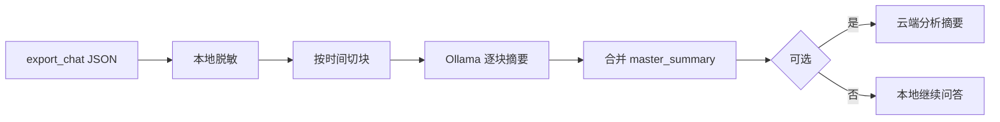

# 微信聊天记录：本地脱敏 + 分块摘要（参考步骤）

> 适用于：已用 [wechat-decrypt](https://github.com/ylytdeng/wechat-decrypt) 导出 JSON，希望在 **不上传原文** 的前提下，用本地小模型做预处理，再（可选）把 **摘要** 交给更强的线上模型分析。  
> 环境示例：Mac mini M2、16GB 内存、单聊数年记录。

---

## 一、目标与原则

| 目标 | 做法 |
|------|------|
| 不上传原始聊天 | 云端只接收 **脱敏后的分块摘要** |
| 控制本地内存 | 按时间切块，逐块处理 |
| 可复现 | 固定目录结构，每步落盘 JSON/TXT |
| 可审计 | 保留「块 ID → 时间范围」索引，便于核对 |

**原则：** 原文与 `all_keys.json` 永不离开本机；不上传网盘、不贴进网页聊天长期会话。

---

## 二、前置准备

### 2.1 软件

| 工具 | 用途 | 安装（macOS） |
|------|------|----------------|
| Python 3.10+ | 脱敏、切块脚本 | 系统自带或 Homebrew |
| [Ollama](https://ollama.com) | 本地摘要模型 | `brew install ollama` |
| 可选：jq | 检查 JSON | `brew install jq` |

### 2.2 本地模型（推荐）

```bash
ollama pull qwen2.5:7b-instruct
# 可选，更慢更好：ollama pull qwen2.5:14b-instruct-q4_K_M
```

### 2.3 从 wechat-decrypt 导出单聊 JSON

在 wechat-decrypt 项目目录、已激活 venv 的前提下：

```bash
# 单聊导出（将「备注名或群名」换成实际显示名）
python export_chat.py "对方备注或昵称" ./work/raw/chat_raw.json

# 若含大量语音且需分析内容，先转录再摘要：
python transcribe_chat.py ./work/raw/chat_raw.json ./work/raw/chat_transcribed.json
```

后续步骤默认输入文件为：`./work/raw/chat_transcribed.json`（无转录则用 `chat_raw.json`）。

### 2.4 工作目录（建议）

```text
work/
├── raw/                    # 原始导出（勿上传）
│   ├── chat_raw.json
│   └── chat_transcribed.json
├── redacted/               # 脱敏后全文（仍勿上传）
│   └── chat_redacted.json
├── chunks/                 # 按时间切分的块
│   ├── chunk_001.json
│   └── ...
├── summaries/              # 本地模型生成的块摘要
│   ├── chunk_001_summary.json
│   └── ...
├── index.json              # 块索引（时间范围、条数）
├── master_summary.md       # 合并后的总摘要（可给云端）
└── prompts/                # 保存用过的 prompt 便于复现
```

```bash
mkdir -p work/{raw,redacted,chunks,summaries,prompts}
```

---

## 三、流程总览



---

## 四、步骤 1：本地脱敏

### 4.1 要处理的内容

| 类型 | 处理方式 |
|------|----------|
| `username`（wxid） | 替换为 `USER_PEER`，自己的发件人统一为 `USER_ME` |
| 手机号、邮箱、身份证号 | 正则替换为 `[PHONE]`、`[EMAIL]`、`[ID]` |
| 银行卡、网址 | `[CARD]`、`[URL]`（可选保留域名类型不写具体 URL） |
| 备注名 `contact_remark` | 改为 `[PEER]` 或保留泛称「对方」 |
| 群聊（若误导出群） | 建议单独流程；群成员 wxid 一律 `[MEMBER_n]` |
| 图片/文件 | 保留 `[图片]`、`[文件]` 等已有占位，不传路径 |

### 4.2 参考脚本 `scripts/redact_chat.py`

将下列脚本保存到项目下 `scripts/redact_chat.py`，按需修改路径后执行。

```python
#!/usr/bin/env python3
"""对 export_chat 导出的 JSON 做本地脱敏。"""
import json
import re
import sys
from pathlib import Path

PHONE_RE = re.compile(r"1[3-9]\d{9}")
EMAIL_RE = re.compile(r"[\w.-]+@[\w.-]+\.\w+")
URL_RE = re.compile(r"https?://\S+")
ID_CARD_RE = re.compile(r"\d{17}[\dXx]|\d{15}")


def redact_text(s: str) -> str:
    if not s:
        return s
    s = PHONE_RE.sub("[PHONE]", s)
    s = EMAIL_RE.sub("[EMAIL]", s)
    s = URL_RE.sub("[URL]", s)
    s = ID_CARD_RE.sub("[ID]", s)
    return s


def main(inp: Path, outp: Path):
    data = json.loads(inp.read_text(encoding="utf-8"))
    peer = data.get("username", "unknown")
    data["username"] = "USER_PEER"
    data["chat"] = "[PEER]"
    for key in ("contact_remark", "contact_nick_name", "contact_memo"):
        if key in data:
            data[key] = "[REDACTED]"

    for msg in data.get("messages", []):
        if msg.get("sender") not in ("me", "USER_ME", ""):
            msg["sender"] = "PEER"
        elif msg.get("sender") == "me":
            msg["sender"] = "USER_ME"
        if "content" in msg and msg["content"]:
            msg["content"] = redact_text(str(msg["content"]))
        if "transcription" in msg and msg["transcription"]:
            msg["transcription"] = redact_text(str(msg["transcription"]))

    meta = {"source_peer_hash": str(hash(peer))[-8:], "message_count": len(data.get("messages", []))}
    data["_redaction_meta"] = meta
    outp.parent.mkdir(parents=True, exist_ok=True)
    outp.write_text(json.dumps(data, ensure_ascii=False, indent=2), encoding="utf-8")
    print(f"Wrote {outp} ({meta['message_count']} messages)")


if __name__ == "__main__":
    if len(sys.argv) < 3:
        print("Usage: python redact_chat.py <input.json> <output.json>")
        sys.exit(1)
    main(Path(sys.argv[1]), Path(sys.argv[2]))
```

执行：

```bash
python scripts/redact_chat.py \
  work/raw/chat_transcribed.json \
  work/redacted/chat_redacted.json
```

### 4.3 人工抽查（建议）

随机打开 `chat_redacted.json` 搜：`wxid_`、`@chatroom`、11 位数字、`.com`。确认无遗漏后再切块。

---

## 五、步骤 2：按时间切块

### 5.1 切块策略（任选其一）

| 策略 | 说明 | 适用 |
|------|------|------|
| **按自然月** | 每月一块 | 几年记录、做时间线（推荐） |
| **按条数** | 每块 300～800 条 | 消息特别密 |
| **按字符** | 每块约 1.5～2 万字 | 控制单次 Ollama 输入 |

### 5.2 参考脚本 `scripts/chunk_by_month.py`

```python
#!/usr/bin/env python3
"""按 UTC+本地 create_time 的月份切块。"""
import json
import sys
from collections import defaultdict
from datetime import datetime
from pathlib import Path


def main(inp: Path, out_dir: Path):
    data = json.loads(inp.read_text(encoding="utf-8"))
    messages = data.get("messages", [])
    by_month = defaultdict(list)
    for m in messages:
        ts = m.get("timestamp") or 0
        key = datetime.fromtimestamp(ts).strftime("%Y-%m")
        by_month[key].append(m)

    out_dir.mkdir(parents=True, exist_ok=True)
    index = []
    for i, (month, msgs) in enumerate(sorted(by_month.items()), start=1):
        chunk_id = f"chunk_{i:03d}"
        chunk = {
            "chunk_id": chunk_id,
            "period": month,
            "message_count": len(msgs),
            "messages": msgs,
        }
        path = out_dir / f"{chunk_id}.json"
        path.write_text(json.dumps(chunk, ensure_ascii=False, indent=2), encoding="utf-8")
        index.append({
            "chunk_id": chunk_id,
            "period": month,
            "file": path.name,
            "message_count": len(msgs),
        })
    index_path = out_dir.parent / "index.json"
    index_path.write_text(
        json.dumps({"chunks": index, "total_messages": len(messages)}, ensure_ascii=False, indent=2),
        encoding="utf-8",
    )
    print(f"Created {len(index)} chunks under {out_dir}")


if __name__ == "__main__":
    main(Path(sys.argv[1]), Path(sys.argv[2]))
```

执行：

```bash
python scripts/chunk_by_month.py \
  work/redacted/chat_redacted.json \
  work/chunks
```

---

## 六、步骤 3：本地逐块摘要（Ollama）

### 6.1 摘要 Prompt 模板

保存为 `work/prompts/summary_per_chunk.txt`：

```text
你正在处理一段已脱敏的两人私聊记录（微信），仅用于个人复盘。
要求：
1. 只根据下文归纳，不要编造未出现的事件、人物、地点。
2. 输出简体中文，使用 Markdown 小标题。
3. 若信息不足，写「本块未体现」。

请输出：
## 时间范围
（根据消息时间戳推断起止日期）

## 主要话题
- （列表，3～8 条）

## 沟通氛围
（双方语气、主动性、是否冷淡/密切）

## 关键节点
（争执、和好、重要决定、约定等；无则写「无」）

## 代表性表述
（最多 5 条，可 paraphrase，不要恢复任何真实姓名、号码）

## 待追问点
（若要做更深入分析，本块还缺什么上下文）

---
对话数据（JSON 片段）：
```

### 6.2 单块调用示例（命令行）

将块转为适合模型的纯文本（简化版可用 `messages` 里 `timestamp` + `sender` + `content`）：

```bash
CHUNK=work/chunks/chunk_001.json
TEXT=$(python3 -c "
import json, datetime
d=json.load(open('$CHUNK'))
lines=[]
for m in d['messages']:
    t=datetime.datetime.fromtimestamp(m['timestamp']).strftime('%Y-%m-%d %H:%M')
    body=m.get('content') or m.get('transcription') or f\"[{m.get('type','?')}]\"
    lines.append(f\"{t} {m.get('sender','')}: {body}\")
print('\n'.join(lines[:500]))  # 单块过长可截断或调大
")

PROMPT=$(cat work/prompts/summary_per_chunk.txt)
ollama run qwen2.5:7b-instruct "${PROMPT}
${TEXT}" > work/summaries/chunk_001_summary.md
```

### 6.3 批量摘要（参考循环）

```bash
for f in work/chunks/chunk_*.json; do
  base=$(basename "$f" .json)
  out="work/summaries/${base}_summary.md"
  [ -f "$out" ] && echo "skip $out" && continue
  echo "summarizing $f ..."
  # 此处可改为调用 scripts/summarize_chunk.py（见下节建议）
  python3 scripts/summarize_one_chunk.py "$f" "$out"
done
```

建议实现 `scripts/summarize_one_chunk.py`：读 chunk JSON → 格式化为文本 → 请求 `http://localhost:11434/api/generate`（Ollama API）→ 写入 `.md`。这样比 shell 拼接更稳。

### 6.4 Ollama API 最小示例（Python）

```python
import json
import urllib.request

def ollama_generate(prompt: str, model: str = "qwen2.5:7b-instruct") -> str:
    payload = json.dumps({"model": model, "prompt": prompt, "stream": False}).encode()
    req = urllib.request.Request(
        "http://localhost:11434/api/generate",
        data=payload,
        headers={"Content-Type": "application/json"},
    )
    with urllib.request.urlopen(req, timeout=600) as resp:
        return json.load(resp)["response"]
```

---

## 七、步骤 4：合并为总摘要

### 7.1 拼接各块 Markdown

```bash
echo "# 聊天分块摘要索引" > work/master_summary.md
echo "" >> work/master_summary.md
cat work/index.json >> work/master_summary.md
echo "" >> work/master_summary.md
for f in work/summaries/chunk_*_summary.md; do
  echo "---" >> work/master_summary.md
  cat "$f" >> work/master_summary.md
  echo "" >> work/master_summary.md
done
```

### 7.2 本地二次归纳（推荐）

对 `master_summary.md` 再跑一轮 Ollama，Prompt 示例：

```text
以下是同一段人际关系在数年时间里的「分月聊天摘要」（已脱敏）。
请写一份 1500 字以内的总报告，包含：
1. 关系阶段划分（按时间段）
2. 话题演变
3. 沟通模式（谁主动、冲突与修复方式）
4. 3～5 条可行动的个人反思建议
不要编造摘要中未出现的事实。
```

输出保存为：`work/master_summary_final.md`  
**此后若使用云端，只上传 `master_summary_final.md`，不要上传 `raw/`、`redacted/`、`chunks/`。**

---

## 八、步骤 5（可选）：云端深度分析

仅当步骤 7 完成后：

| 上传内容 | 禁止上传 |
|----------|----------|
| `master_summary_final.md` | `chat_raw.json`、`chat_redacted.json`、`chunks/` |
| 你的分析问题（列表） | `all_keys.json`、微信密钥 |

**Prompt 示例：**

```text
附件是一份已脱敏的私聊分月摘要汇总，不含真实姓名与账号。
请基于摘要回答：
1. 沟通模式是否存在重复性问题？
2. 哪些时间段互动质量明显下降？可能原因是什么（仅根据摘要推断，注明不确定性）？
3. 若希望改善关系，给出 5 条具体、可执行建议。
不要还原或猜测任何真实身份。
```

**渠道建议：** 优先 API（可关训练选项的版本），避免把全文贴进网页版长期对话。国内可选 DeepSeek/通义等；境外可选 Claude/GPT-4o API。上传前再通读一遍摘要，确认无漏网的手机号、地名、公司全名。

---

## 九、质量与成本参考

| 规模（约） | 块数（按月） | 本地 7B 耗时（粗估） | 云端 token |
|------------|--------------|----------------------|------------|
| 1 年、1～2 万条 | 12 | 十余分钟～半小时 | 仅总摘要，很少 |
| 3～5 年、5～10 万条 | 36～60 | 1～3 小时 | 仍很少 |

**提速：** 块摘要可夜间批跑；已生成的 `summaries/*.md` 不要重复跑。

---

## 十、安全检查清单

- [ ] `work/raw/` 与 `all_keys.json` 未上传任何云服务  
- [ ] 脱敏后全文无 `wxid_`、11 位手机号  
- [ ] 云端仅收到 `master_summary_final.md`（或更短的二次摘要）  
- [ ] 群聊、他人隐私已排除或单独脱敏  
- [ ] 分析结果本地加密备份（可选：FileVault + 加密 zip）  
- [ ] 不需要时删除 `raw/`、`redacted/`（或移入离线硬盘）

---

## 十一、常见问题

**Q：语音很多，摘要说不出内容？**  
A: 导出时加 `transcribe_chat.py` 或 `export_all_chats.py --with-transcriptions`。

**Q：块太大 Ollama 变慢或 OOM？**  
A: 改为按周切块，或单块只取文本消息 + 语音转写，过滤 `type=image` 的重复占位。

**Q：能否跳过本地摘要，直接把脱敏块给云端？**  
A: 可以，但暴露面大于「只传总摘要」；若做，仍不要传 `raw`，且块内勿含可识别身份的信息。

**Q：和《微信 4.x 解密后数据库速查说明》的关系？**  
A: 该文档讲数据库与导出格式；本文档讲导出后的 **隐私安全分析流水线**。

---

## 十二、相关文件

| 文档 | 路径 |
|------|------|
| 数据库速查 | `微信 4.x 解密后数据库速查说明.md` |
| 导出 JSON 字段 | wechat-decrypt 仓库 `docs/chat_export_format.md` |

---

*文档版本：2026-05，流程以 wechat-decrypt `export_chat.py` JSON 为准；脚本为参考实现，可按需扩展。*
