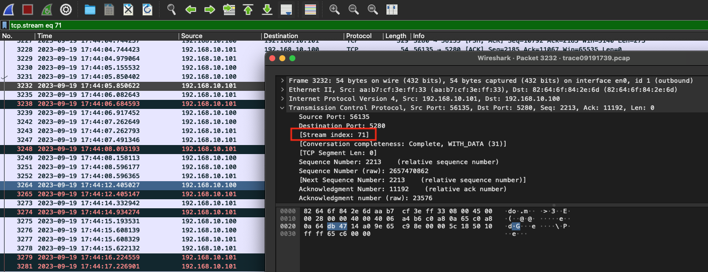
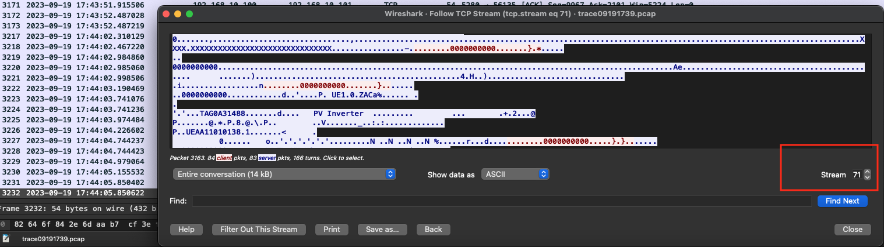

# WireShark过滤

## WireShark Filter

[Wireshark过滤规则](https://markrepo.github.io/tools/2018/06/25/Wireshark/)

[Wireshark过滤器写法总结](https://www.cnblogs.com/willingtolove/p/12519490.html)

[【汇总】Wireshark 过滤规则 ](https://www.cnblogs.com/v1vvwv/p/Wireshark-filtering-rules.html)

匹配seq序列号 为 0 的包：`tcp.seq == 0`

匹配syn 为 1 的包：`tcp.flags.syn==1`

匹配fin 为 1 的包：`tcp.flags.fin==1`

匹配RST包：`tcp.flags.reset==1`

wireshark

匹配ip为192.168.10.100且序列号为0的包
`ip.addr == 192.168.10.100 and tcp.seq == 0`

匹配重发包: `tcp.analysis.retransmission or tcp.analysis.fast_retransmission`

匹配重发包
`ip.addr == 192.168.10.100 and tcp.analysis.retransmission`

`ip.addr == 192.168.10.100 and (tcp.flags.fin==1 or tcp.flags.reset==1)`

### 使用Stream index（tcp流 编号）过滤 

使用WireShark抓包的时候，会给每一个新增加的tcp session编一个号码, 取名为tcp stream index，方便数据查看。这个号码可以双击包，点开Transmission Control Protocol域，可以找到（第三行？）[Stream index: xx] ，这个就是Stream的编号。也可以右键->Follow->TCP Stream, 在数据框的右下角，'Find Next'的上方，可以查看到index号码。

`tcp.stream eq 7` 显示stream编号为71的tcp流

