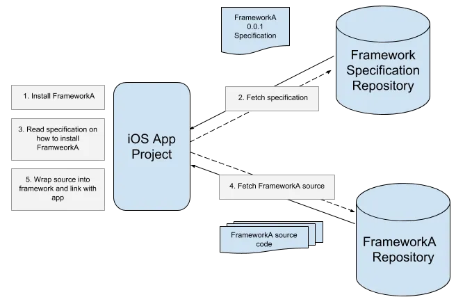

# Create your iOS Framework

**Swift 5**

### 工程配置

### Swift And Objective-C 混编相关
[Importing Swift into Objective-C](https://developer.apple.com/documentation/swift/importing-swift-into-objective-c)

库要在OC项目也能用：

* ` -init is unavailable`

	> Methods and properties that are marked with the internal modifier and declared within a class that inherits from an Objective-C class are accessible to the Objective-C runtime. 

* `an enumeration over String in swift cannot be translated`

#### 将Swfit中的类、属性、方法开放给OC Runtime

* 继承至OC类的类可以直接被Objective-C使用
* 类属性及方法必须使用`@objec`，才能被Objective-C使用
* 继承至OC类的类或使用`@objc`修饰的类,Designated initializers可以被Objective-C调用，其它方法需要使用`@objc`
* 只有整型的enum才能被OC调用，并且需要用`@objc`修饰
* OC不能继承swift类，那怕是`@objc`, `NSObject`也不行

### Framework创建

#### Apple WWDC
[Creating Swift Packages](https://developer.apple.com/videos/play/wwdc2019/410)

[Swift packages: Resources and localization](https://developer.apple.com/videos/play/wwdc2019/410)

[Binary Frameworks in Swift](https://developer.apple.com/videos/play/wwdc2019/416/)

[Creating a Framework](https://developer.apple.com/library/archive/documentation/MacOSX/Conceptual/BPFrameworks/Tasks/CreatingFrameworks.html)

#### others

[Create your custom iOS Framework in Xcode 12.4 with Objective-C/Swift, including CocoaPods](https://hyderium.medium.com/create-your-custom-ios-framework-in-xcode-12-4-with-objective-c-swift-including-cocoapods-2967b582ed5e)

[Swift Framework — Ch: 1 . Develop a Swift Framework](https://medium.com/captain-ios-experts/develop-a-swift-framework-1c7fdda27bf1)

[Creating a Framework for iOS](https://www.kodeco.com/17753301-creating-a-framework-for-ios)

[Swift+第三方库的framework制作流程详解](https://juejin.cn/post/7080055787497717790)

### Framework编译

### Xcode应用

[Managing multiple projects and their dependencies](https://developer.apple.com/documentation/xcode/managing-multiple-projects-and-their-dependencies)

### Distributing

#### 发布到CocoaPods

Cocoapods — pod install overview：

- 创建Framework代码仓库，并提交，生成远程访问url, 如`https://path/to/yourname/GRTFramework.git`
- 创建Framework Specification仓库，并提交，生成远程访问url，如`https://path/to/yourname/GRTSpecs.git`
- 将新建的Framework Specification仓库添加到CocoaPods源
	`pod repo add your-spces https://path/to/yourname/GRTSpecs.git`
	- CocoaPods 增加、移除源或镜像
		- 增加: `pod repo add your-spces https://path/to/yourname/GRTSpecs.git`
		- 移除: `pod repo remove your-spces`
		- 查看当前有的源`pod repo list`
	
		> 注：新版的 CocoaPods 不允许用pod repo add直接添加master库
- 生成Framework在Specification中的配置文件
	* 先将Framework的项目，打一个版本tag: `git tag -a 0.0.1 -m "Version 0.0.1"`，并推送到远程。
	* 使用`pod spec create`会生成名称为`当前文件名.podspec`的配置文件,配置信息见[Podspec](https://guides.cocoapods.org/syntax/podspec.html), 手动创建也是可以的，`spec.version= "0.0.1"`配置成刚打的tag。
	* 将配置文件信息推送到源
		- `pod repo push your-spces ~/当前文件名.podspec`，此命令是验证配置`.podspec`文件的有效性，并将信息推到`your-spces`指定的源url。
		- 如 `pod repo push growatt-specs ~/Documents/GRTKit/GRTInverterKit.podspec --verbose --allow-warnings`
	* 在`Podfile`上加入Framework
	
	>
	> platform :ios, '12.0'
	>
	>target 'Your Project' do
	
	>use_frameworks!
	>pod 'GRTInverterKit', :source => "https://path/to/yourname/GRTSpecs.git"
	
	>end

	如果使用frameworks，必须要加上`use_frameworks!`

	* 在`pod install --no-repo-update `
	* 如果使用frameworks, 引入项目为`@import YourKit;`

[Distributing Swift Frameworks via Cocoapods](https://medium.com/onfido-tech/distributing-swift-frameworks-via-cocoapods-152002b41783)

[How to distribute iOS frameworks using Carthage](https://anuragajwani.medium.com/how-to-distribute-ios-frameworks-using-carthage-e47ef77e2fc4)