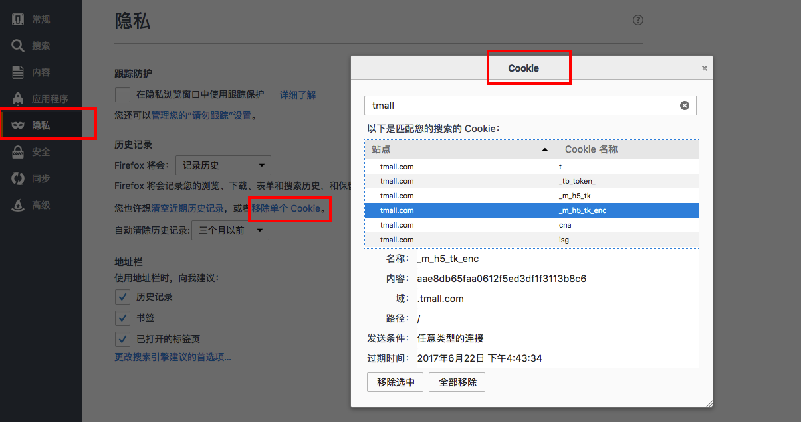

## 一, 什么是Cookies？

Cookie 是由服务器保存在用户浏览器（客户端）上的一块数据，它可以包含有关用户的信息,比如果登陆的状态，用户标识等。

>HTTP Cookie（也叫Web cookie或者浏览器Cookie）是服务器发送到用户浏览器并保存在浏览器上的一块数据，它会在浏览器下一次发起请求时被携带并发送到服务器上。比较经典的，可以它用来确定两次请求是否来自于同一个浏览器，从而能够确认和保持用户的登录状态。Cookie的使用使得基于无状态的HTTP协议上记录稳定的状态信息成为了可能。

###Cookie有什么作用？
主要用在以下三个方面:

* 会话状态管理（如用户登录状态、购物车）

* 个性化设置（如用户自定义设置）

* 浏览器行为跟踪（如跟踪分析用户行为）

### cookie的处理步骤
cookie 是 http 协议的一部分，它的处理分为如下几步：

* 服务器向客户端发送 cookie。
	* 通常使用 HTTP 协议规定的 Set-Cookie 头操作。
	* 规范规定 cookie 的格式为 name = value 格式，且必须包含这部分。
* 浏览器将 cookie 保存。
* 每次请求浏览器都会将 cookie 发向服务器。

其他可选的 cookie 参数会影响将 cookie 发送给服务器端的过程，主要有以下几种：

* path：表示 cookie 影响到的路径，匹配该路径才发送这个 cookie。
* expires 和 maxAge：告诉浏览器这个 cookie 什么时候过期，expires 是 UTC 格式时间，maxAge 是 cookie 多久后过期的相对时间。当不设置这两个选项时，会产生 session cookie，session cookie 是 transient 的，当用户关闭浏览器时，就被清除。一般用来保存 session 的 session_id。
* secure：当 secure 值为 true 时，cookie 在 HTTP 中是无效，在 HTTPS 中才有效。
* httpOnly：浏览器不允许脚本操作 document.cookie 去更改 cookie。一般情况下都应该设置这个为 true，这样可以避免被 xss 攻击拿到 cookie。

### Cookies 长什么样子？

当服务器收到HTTP请求时，可以在响应头里面增加一个Set-Cookie头部。浏览器收到响应之后会取出Cookie信息并保存，之后对该服务器每一次请求中都通过Cookie请求头部将Cookie信息发送给服务器。大概都长的都是这个格式：

	Set-Cookie: <cookie名称>=<cookie值>
	
所以一个简单的 Cookie 像这样：

	Set-Cookie = JSESSIONID=B26C93E76786551423AEA6DC74DFE676; Path=/; 

也有像这样子的（Expires 指定一个特定的过期时间）：

	Set-Cookie: id=a3fWa; Expires=Wed, 21 Oct 2015 07:28:00 GMT;


**各浏览器 Cookie 的存放位置**
>可以在浏览器的偏好设置里面查看和管理Cookies
>
>safari ： ~/library/cookies
>
>chrome ： ~/Library/Application\ Support/Google/Chrome/Default/Cookies
>
>Firefox ： ~/Library/Application\ Support/Firefox/Profiles/q0aq3fau.default/cookies.sqlite
>



<!---->

*参考资料*

[cookie 和 session](https://github.com/alsotang/node-lessons/tree/master/lesson16)

***严重推荐阅读MDN对 [HTTP cookies](https://developer.mozilla.org/zh-CN/docs/Web/HTTP/Cookies "Mozilla Developer Network") 的说明**

*****

## 二, 在iOS 中使用 Cookies

#### 先看看Cookie有关的三个工具

* NSHTTPCookieStorage

这个类就是一个单例，它的主要任务就是管理 Cookies, 增删改查等各种

* NSURLRequest

`NSURLRequest `是HTTP请求协议URL资源的消息对象Request。主要需要设置`URL`，可设置超时时间`timeoutInterval`，以及增加各种请求头，比如：
>
```
{
    Accept = "application/octet-stream";
    "Content-TotalSize" = 1458598;
    "Content-TransferAct" = 0;
    "Content-TransferInfo" = "userid=646;pid=0;filename=IMG_4599.JPG;filemd5=cad853931741744be14b7a54bec2308e;";
    "Set-Cookie" = "JSESSIONID=B26C93E76786551423AEA6DC74DFE676; Path=/";
    "Content-TransferPos" = 0;
    "Content-Type" = "application/octet-stream";
}
这其中就有我们终端需要加服务的Cookie, 其中包含了SessionId
```

* NSHTTPURLResponse

>
`NSHTTPURLResponse` 是HTTP协议请求URL资源的响应消息对象。这个对象将HTTP协议的序列化了，可以很方便的获得的状态码(`statusCode`)，消息报头(`allHeaderFields`)等信息，比如：

>```
{
HTTP/1.1 200 OK  //协议版本以及状态码
      "Access-Control-Allow-Methods" = "POST,GET";
      "Content-Language" = "zh-CN";
      "Content-Type" = "text/json;charset=UTF-8";
      Server = "nginx/1.11.8";
      "Set-Cookie" = "JSESSIONID=B26C93E76786551423AEA6DC74DFE676; Path=/";
      lastClient = iPhone;
      lastIp = "192.168.4.121";
}
这其中就有服务器给我们的终端Cookie, 其中包含了SessionId
>```

### 开始手动管理 Cookies

##### 从 `NSHTTPURLResponse ` 获取服务器发给我们的 Cookie

```
	NSHTTPURLResponse* response = (NSHTTPURLResponse* )task.response;
	NSDictionary *allHeaderFieldsDic = response.allHeaderFields;
	NSString *setCookie = allHeaderFieldsDic[@"Set-Cookie"];
	if (setCookie != nil) {
		 NSString *cookie = [[setCookie componentsSeparatedByString:@";"] objectAtIndex:0];
		 NSLog(@"cookie : %@", cookie); // 这里可对cookie进行存储
	}
```

##### 从 `NSHTTPCookieStorage ` 获取想要Cookie
```
NSHTTPCookieStorage *storagedCookies = [NSHTTPCookieStorage sharedHTTPCookieStorage];
                     for (NSHTTPCookie *cookie in storagedCookies.cookies){
                         NSLog(@"cookie : %@", cookie);
                     }
```


##### 清除Cookie 

```
/**
 *  清除Cookie,如比在用户重新登录的时候需要用的着
 */

NSHTTPCookieStorage *cookieStorage = [NSHTTPCookieStorage sharedHTTPCookieStorage];
    NSArray *_tmpArray = [NSArray arrayWithArray:[cookieStorage cookies]];
    for (id obj in _tmpArray) {
        [cookieStorage deleteCookie:obj];
    }
    
```

### 三, 使用 AFNetworking 时，对Cookies管理的示例
AFNetworking 3.0 默认是保存cookies的。

`AFHTTPSessionManager`的`requestSerializer`的属性`HTTPShouldHandleCookies `默认就是 YES

模拟登录，保存cookie以及设置cookie:

```
NSURLSessionConfiguration *sessionConfiguration = [NSURLSessionConfiguration defaultSessionConfiguration];
    AFHTTPSessionManager *httpManager = [[AFHTTPSessionManager alloc] initWithBaseURL:[NSURL URLWithString:@"hostURL"] sessionConfiguration:sessionConfiguration];
    AFHTTPRequestSerializer *requestSerialization = [AFHTTPRequestSerializer serializer];
    requestSerialization.timeoutInterval = 15;
    
    // 设置自动管理Cookies
    requestSerialization.HTTPShouldHandleCookies = YES;
    
    // 如果已有Cookie, 则把你的cookie符上
    NSString *cookie = [[NSUserDefaults standardUserDefaults] objectForKey:@"Set-Cookie"];
        if (cookie != nil) {
            [requestSerialization setValue:cookie forHTTPHeaderField:@"Set-Cookie"];
        }
    
    // 安全策略
    AFSecurityPolicy *securityPolicy = [AFSecurityPolicy policyWithPinningMode:AFSSLPinningModeNone];
    securityPolicy.allowInvalidCertificates = YES;
    securityPolicy.validatesDomainName = NO;
    
    [httpManager POST:@"logInURL"
           parameters:nil
             progress:NULL
              success:^(NSURLSessionDataTask * _Nonnull task, id  _Nullable responseObject) {
                  if ([responseObject[@"status"] isEqualToString:@"SUCCESS"]) {
                      //获取 Cookie
                      NSHTTPURLResponse* response = (NSHTTPURLResponse* )task.response;
                      NSDictionary *allHeaderFieldsDic = response.allHeaderFields;
                      NSString *setCookie = allHeaderFieldsDic[@"Set-Cookie"];
                      if (setCookie != nil) {
                          NSString *cookie = [[setCookie componentsSeparatedByString:@";"] objectAtIndex:0];
                          // 这里对cookie进行存储
                          [[NSUserDefaults standardUserDefaults] setObject:cookie forKey:@"cookie"];
                      }
                  }else{
                      // 登录失败
                  }
              }
              failure:^(NSURLSessionDataTask * _Nullable task, NSError * _Nonnull error) {
                  NSString *errorMessage = error.userInfo[@"NSLocalizedDescription"];
              }];
              
```