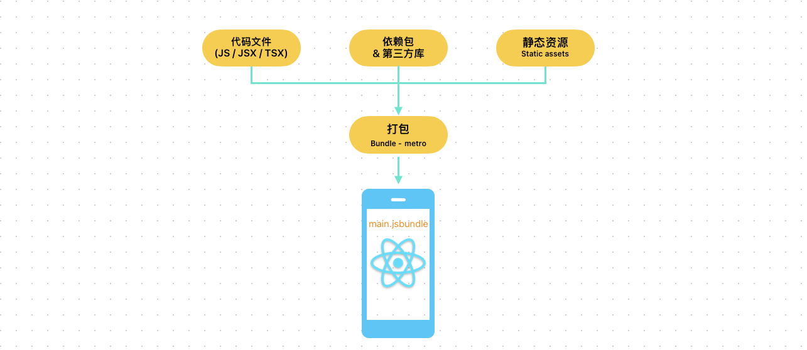
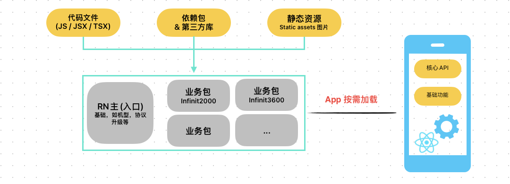
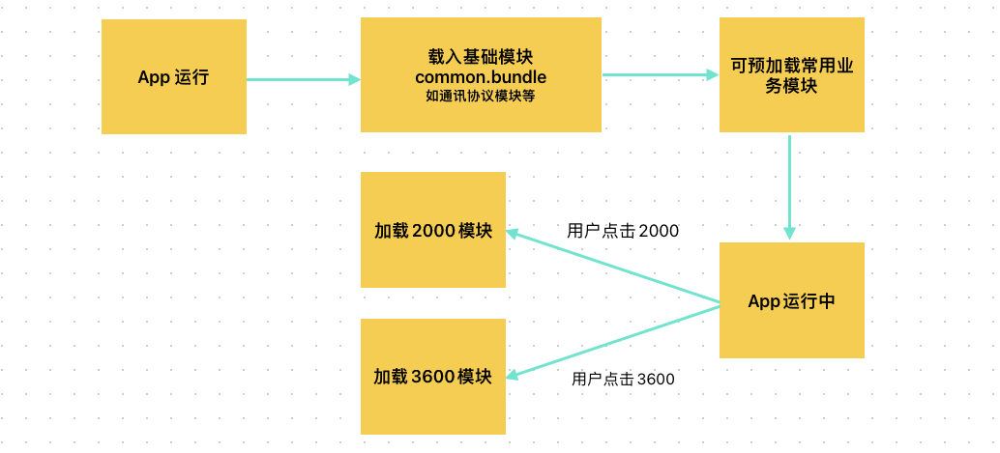

# React-Native分包

### 需求及分包

React Native的功能，在开发时一般是作为功能模块或者依赖包以整体的方式进行开发。然后使用打包工具进行打包，一般会将代码，依赖库和资源文件打出一个`main.jsbundle`文件，在原生app上运行，如下图：

但当业务变多，业务逻辑会变复杂，包文件的大小会增加，不管在功能管理及加载速度上都会影响app，这个时候就要对包进行拆包管理，可拆为基础包，如一些核心API及基础功能。以及若干个业务包，App根据需要，按需加载所需要的包。

App运行时载入流程：

### 分包实现

开发时代码模块化，并通过RN bundler,如Metro/webpack等打包管理器实现

* 实际操作中通过配置`metro.config.js`文件实现分包打包
* 可使用shell或其它的脚本实现自动分包打包

### 各模块间的数据通讯

原生与RN模块之间的通讯，主要通过React Native 官方的 `RCTBridge`实例实现。

RN模块与RN模块之间可通过原生为桥梁或者在开发时通过JS引用实现。

### 调用代码

#### JS端

需要区分不同的包，提供不同的入口，使用`registerComponent`进行不同包的注册，如：

`AppRegistry.registerComponent('Module1', () => App);`

`index1.js`为包1的入口, 则在`index1.js`文件中注册，打包包1的包时，以`index1.js`文件为入口。

包2的入口为`inex2.js`,则：

`AppRegistry.registerComponent('Module2', () => App);`

**方法暴露则按之前与原生对接的方式进行暴露**

#### iOS端

在app 启动函数`- (BOOL)application:(UIApplication *)application didFinishLaunchingWithOptions:(NSDictionary *)launchOptions`中，或者其它合适的时机，创建`RCTBridge`实例。后面通过此桥梁实例与各模块间建立通讯。

* 创建`RCTBridge`实例:

	`RCTBridge *bridge = [[RCTBridge alloc] initWithDelegate:self launchOptions:launchOptions];`

* 获取RN 基础模块-设备协议 模块实例:
	
	`id inverterkit = [bridge moduleForName:@"InverterKit"];`

* 调用RN基础模块模块方法:

	`[inverterkit methodWithName:@"myMethod" withArguments:@[@"arg1", @"arg2"]];`

#### 安卓端

* 创建`RCTBridge`实例:

### 实操作

待年后，赶上安卓后

参考资料：

[Loading multiple bundles in react-native | Code splitting using Metro](https://varunon9.medium.com/loading-multiple-bundles-in-react-native-code-splitting-using-metro-44d45530e958)

[react-native-multiple-bundle](https://github.com/varunon9/react-native-multiple-bundle)

[Code Splitting in React Native Applications](https://www.callstack.com/blog/code-splitting-in-react-native-applications)

[React Native 拆包及实践「iOS&Android」](https://github.com/yxyhail/MetroExample)