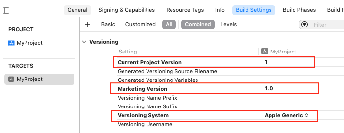
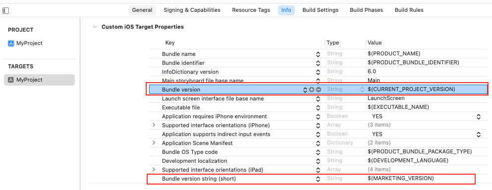
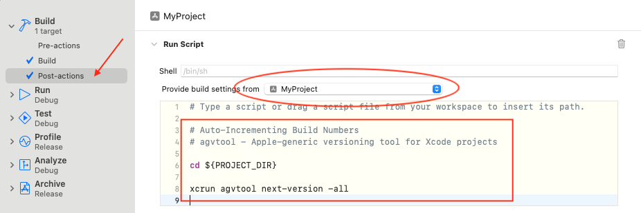
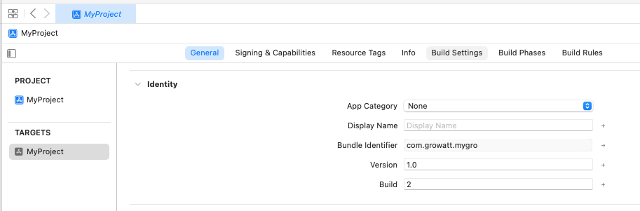

# Xcode自动增加Build及号


[Automating Version and Build Numbers Using agvtool](https://developer.apple.com/library/archive/qa/qa1827/_index.html)


```
# Auto-Incrementing Build Numbers
# agvtool - Apple-generic versioning tool for Xcode projects
# 自动更新编译号, 此命令是将工程编译号自动增加为下一个最大的整数
echo "自动更新编译号, 此命令是将工程编译号自动增加为下一个最大的整数, 如当前为1.1 即自动增加为2"
cd ${SRCROOT}
or `cd ${PROJECT_DIR}`
pwd
xcrun agvtool next-version -all
# xcrun agvtool new-version -all 69
```

#### Set the build number to 2.6.9

`xcrun agvtool new-version -all 2.6.9`

直接在Build Phase中增加Run Script Phase会因更改信息，而中断Build。Scheme中增加Pre-actions或者Post-actions。

* The version number, which is the number shown to your application’s users, identifies a released version of your application. It is stored in your application’s Info.plist as `CFBundleShortVersionString` (Bundle versions string, short) .

* The build number identifies an unreleased or released version of your application. It is stored in your application’s Info.plist as `CFBundleVersion` (Bundle version).





