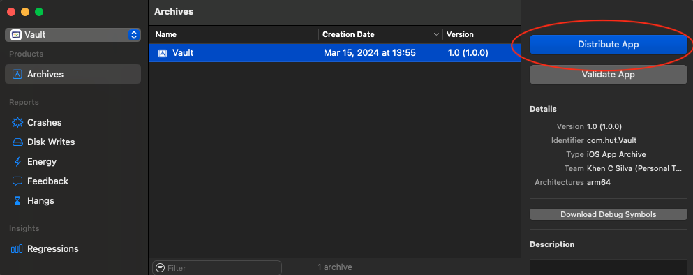
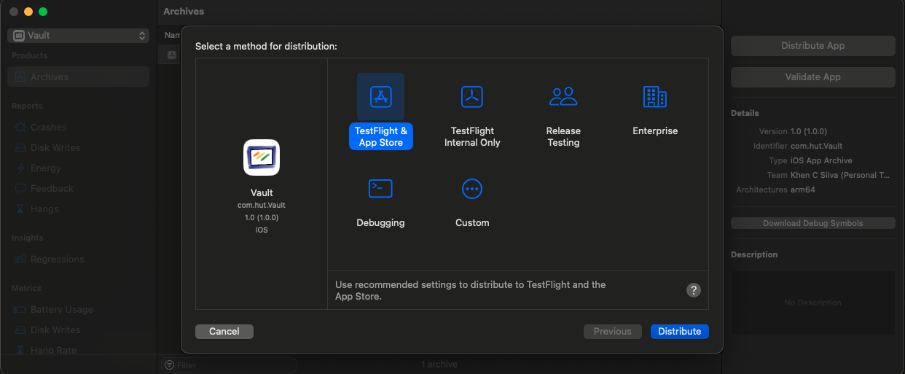

# xcodebuild-CLI打包

## 关于`xcodebuild `

xcodebuild(Xcode的命令行工具)是一系列的命令集，通过命令调用Xcode对Xcode项目进行编译打包，是CI/CD开发的有效工具。xcodebuild是Xcode的内置工具，一般安装了Xcode就有xcodebuild。

### 查看`xcodebuild`是否安装

```
% xcodebuild -version
Xcode 15.2
Build version 15C500b
```

### 安装`xcodebuild`

* 手动安装
	
如果没有也可以在这里下载：[Download for Apple Developers](https://developer.apple.com/download/all/)，需要登录。
	
* 通过命令安装：
`xcode-select --install`

>macOS comes bundled with xcode-select, a command-line tool that is installed in `/usr/bin`.

### 切换`xcodebuild`使用的Xcode版本

如果电脑上安装了多个Xcode版本，就是需要确认当前`xcodebuild`使用的Xcode版本，及在各个版本之间切换。

* `xcode-select --print-path`: 查看当前使用的Xcode版本
* `sudo xcode-select -switch <path/to/>Xcode.app`: 切换Xcode版本

## Xcode项目中的概念

* project文件: 以`. xcodeproj` 结尾的文件，连接及组织项目里的所有代码及资源
	* 代码文件，布局文件，图片及其它各种资源文件
	* 项目的目录结构，及内外部的Libraries
	*  编译配置(build configurations), project下一般有有`Debug`和`Release`两种编译配置。
	*  不同的targets和Scheme
	*  [Xcode Project](https://developer.apple.com/library/archive/featuredarticles/XcodeConcepts/Concept-Projects.html#//apple_ref/doc/uid/TP40009328-CH5-SW1)
* workspace文件: 以`. xcworkspace` 结尾的文件
	* 可以包含多个project项目，如`Pods`生成的`mypro.xcworkspace `里就有`mypro.xcodeproj`和Pods文件夹内的`Pods.xcodeproj`两个项目
	* Workspaces Extend the Scope of Your Workflow 如你在项目中可以快捷找到Pods中库内的方法定义
	* Projects in a Workspace Share a Build Directory
	* [Xcode Workspace](https://developer.apple.com/library/archive/featuredarticles/XcodeConcepts/Concept-Workspace.html#//apple_ref/doc/uid/TP40009328-CH7-SW1)
* Target: 一个项目至少有一个target, 每一个target都有一个编译配置，继承于project
* Scheme: 每一个target至少有一个Scheme, scheme定义了Build, Run, Test, Archive, Profile 和 Analyze等动作的执行，配置环境，周期点等。
* Build configuration: 有Release和Debug两种配置。
* Certificate, Identifier, and profile
	* **Certificate**: 签名证书，分开发及开布证书等
	* **Identifier**: 一般指Bundle Identifier, 如com.xxxx.projectName
	* **Provisioning Profile**: 包含Identifier, Certificate, Team, app's apability, and testing devices 等

## `xcodebuild`的使用

查看帮助文档以及对应参数的意思：`man xcodebuild` or `xcodebuild -help`

**Action**：

| 命令 | 说明 | 其它 |
| ---- | --- | ---- |
| build | 构建target，当没有其他action指定时，这是xcodebuild默认的一个action | ---- |
| archive | --- | 存档对应的构建scheme，需要指定scheme |
| test | --- | 测试 |
| ... | 还有很多... | ... |

**参数选项**：

| 参数名称 | 可设置参数 | 说明 |
| ---- | --- | ---- |
| -help | ---- | 查看帮助 |
| -list | ---- | 列出了在一个工作空间中的一个项目的目标和配置，或方案 |
| -sdk | `iphoneos` ...? | 指定 Base SDK 的规范名称（Canonical Name）或完整路径。通过`xcodebuild -showsdks -json`查看所有可用的 SDK 的完整信息 |
| -arch | `arm64` `armv7` `armv7s` | 指定构建的包所支持的指令集 |
| -showsdks | --- | display a compact list of the installed SDKs |
| ... | 还有很多... | ... |

### 常用指令

* 列出workspace中的所有schemes：

	`xcodebuild -list -workspace <your_workspace_name>.xcworkspace`

* clean scheme

	`xcodebuild clean`  清理之前的编译数据
	
	`xcodebuild clean build -workspace "ProjectName.xcworkspace" -scheme "ProjectName" CODE_SIGNING_REQUIRED=NO CODE_SIGNING_ALLOWED="NO"`
	
* 获取target信息,版号,build号等，以Project Vault为例：

	```
	$ xcodebuild -showBuildSettings -target Vault
	....
	INFOPLIST_KEY_CFBundleDisplayName = Vault
	PRODUCT_NAME = Vault
	MARKETING_VERSION = 1.0
	CURRENT_PROJECT_VERSION = 24
	DWARF_DSYM_FILE_NAME = Vault.app.dSYM
	INFOPLIST_FILE = Vault/Info.plist
	EXECUTABLE_FOLDER_PATH = Vault.app
	```
	获取build号：`xcodebuild -showBuildSettings -target Vault | grep CURRENT_PROJECT_VERSION | sed 's/CURRENT_PROJECT_VERSION = //g'`
	获取DisplayName：`xcodebuild -showBuildSettings -target Vault | grep INFOPLIST_KEY_CFBundleDisplayName | sed 's/INFOPLIST_KEY_CFBundleDisplayName = //g'`
	获取ProductName：`xcodebuild -showBuildSettings -target Vault | grep PRODUCT_NAME | sed 's/PRODUCT_NAME = //g'`
	
* 列出project中所有的targets, build配置，schemes：

	`xcodebuild -list -project <your_project_name>.xcodeproj`
	
* 编译scheme:

	`xcodebuild -scheme <your_scheme_name> build`
	
* build workspace:

	`xcodebuild build -workspace YourProject.xcworkspace -scheme YourProject_scheme`
	
* Archive Workspace:

	`xcodebuild archive -workspace YourProject.xcworkspace -scheme YourProject_scheme -archivePath Archive/YourProject.xcarchive`
	
	`xcodebuild archive -workspace YourProject.xcworkspace -scheme "I am Groot" -sdk iphoneos -destination generic/platform=iOS -archivePath ./Archive/YourProject.xcarchive`

* 导出IPA文件

导出ipa文件需要一个`ExportOptions.plist`，（[详情见下面的ExportOptions](#什么是ExportOptions文件)）这个文件设置导出ipa的类型，像App Store或者Ad Hoc等及以签名信息。在使用Xcode UI打包的时候，如设置`Automatically Manage Signing`时，Xcode会自动生成这个文件。在Xcode15中，是在Archive界面中，导出ipa时的配置信息：Distribute App -> Select a method for distribution。

命令格式为：`xcodebuild -exportArchive -archivePath <xcarchivepath> -exportPath <destinationpath> -exportOptionsPlist <path>`

如导出iOS App:

Manual: `xcodebuild -exportArchive -archivePath yourfile.xcarchive -exportPath Release/MyApp -exportOptionsPlist OptionsPlist.plist`

Auto: `xcodebuild -exportArchive -archivePath yourfile.xcarchive -exportPath Release/MyApp -exportOptionsPlist OptionsPlist.plist --allowProvisioningUpdates`

### 测试

在iPhone上测试一个scheme：

`xcodebuild test -workspace MyApplication.xcworkspace -scheme iOSApp -destination 'platform=iOS,id=965058a1c30d845d0dcec81cd6b908650a0d701c'`

也可以指定手机名称：

`xcodebuild test -workspace "ProjectName.xcworkspace" -scheme "ProjectName" -sdk "iphonesimulator" -destination "platform=iOS Simulator,name=iPhone 11 Pro"`


### 什么是ExportOptions文件

`ExportOptions.plist`文件就是配置在GUI下,如下步骤中的信息, 如签名，选择TestFlight & App Store, Debugging, Release Testing或Custom等标准套餐， Select App Thinning option等。





如果选择`Custom`选项，则会看到更多的自定义导出ipa的信息, 详情可见：[Distributing your app for beta testing and releases](https://developer.apple.com/documentation/xcode/distributing-your-app-for-beta-testing-and-releases)

`ExportOptions.plist`可配置的选项可以通过`xcodebuild -help`命令，拉到最下面`Available keys for -exportOptionsPlist:` 模块中有详细的说明，这里列举一些常用的：

| key | 类型 | 可设置选项 | 说明 |
| ---- | --- | ---- | ----- |
| teamID | String | --- | The Developer team to use for this export |
| destination | String | `export`, `upload` | 打包到本地还是上传，但具体要看method, 默认为`export` |
| thinning | String | `<none>`,  `<thin-for-all-variants>` | For non-App Store exports, should Xcode thin the package for one or more device variants? |
| compileBitcode | Bool | `YES`, `NO` | For non-App Store exports, should Xcode re-compile the app from bitcode? Defaults to YES. |
| method | String | `app-store`, `validation`, `ad-hoc`, `package`, `enterprise`, `development`, `developer-id`, and `mac-application` | how Xcode should export the archive |
| signingStyle | String | `manual`，`automatic` | The signing style to use when re-signing the app for distribution |
| stripSwiftSymbols | Bool | `YES`, `NO` | Should symbols be stripped from Swift libraries in your IPA? Defaults to YES. |
| uploadSymbols | Bool | `YES`, `NO` | For App Store exports, should the package include symbols? Defaults to YES. |
| --- | --- | 以下是手动签名需要配置的信息 | ----- |
| provisioningProfiles | Dictionary | `AppBundleID`: String | For manual signing only. |
| signingCertificate | String | `Mac App Distribution`, `iOS Distribution`, `iOS Developer`, `Developer ID Application`, `Apple Distribution`, `Mac Developer`, and `Apple Development` | For manual signing only. Provide a certificate name |
| --- | --- | 其它配置信息 | ----- |
| manifest | Dictionary | `appURL`, `displayImageURL`, `fullSizeImageURL` | 生成manifest分发文件 |
| generateAppStoreInformation | Bool | `YES`, `NO` | 是否生成信息文件给iTMSTransporter上传使用 |

用于手动签名的`ExportOptions.plist`文件示例：`ExportOptions-manual.plist`

```
<?xml version="1.0" encoding="UTF-8"?>
<!DOCTYPE plist PUBLIC "-//Apple//DTD PLIST 1.0//EN" "http://www.apple.com/DTDs/PropertyList-1.0.dtd">
<plist version="1.0">
<dict>
	<key>compileBitcode</key>
	<true/>
	<key>method</key>
	<string>ad-hoc</string>
	<key>provisioningProfiles</key>
	<dict>
		<key>AppBundleID like com.xxx.myapp</key>
		<string>Profile file name</string>
		<key>AppBundleIDNotificationServiceExtension like extension.com.xxx.myapp</key>
		<string>Profile file name</string>
	</dict>
	<key>signingCertificate</key>
	<string>Certificate Name like iPhone Distribution 此项可选</string>
	<key>signingStyle</key>
	<string>manual</string>
	<key>stripSwiftSymbols</key>
	<true/>
	<key>teamID</key>
	<string>YourTeamID</string>
	<key>thinning</key>
	<string>&lt;none&gt;</string>
</dict>
</plist>
```

用于自动签名的`ExportOptions.plist`文件示例：`ExportOptions-automatic.plist`

```
<?xml version="1.0" encoding="UTF-8"?>
<!DOCTYPE plist PUBLIC "-//Apple//DTD PLIST 1.0//EN" "http://www.apple.com/DTDs/PropertyList-1.0.dtd">
<plist version="1.0">
<dict>
	<key>compileBitcode</key>
	<true/>
	<key>signingStyle</key>
	<string>automatic</string>
	<key>method</key>
	<string>ad-hoc</string>
	<key>stripSwiftSymbols</key>
	<true/>
	<key>teamID</key>
	<string>YourTeamID</string>
	<key>thinning</key>
	<string>&lt;none&gt;</string>
</dict>
</plist>

```

## 问题记录

#### No signing certificate "iOS Distribution" found

`error: exportArchive: No signing certificate "iOS Distribution" found`

解决：检查teamID是否正确

#### No profiles for 'xxx.xxx.xxx' were found

`error: exportArchive: No profiles for 'com.growatt.mygro' were found`

解决：

1. 在`xcodebuild`命令后拼接`-allowProvisioningUpdates`选项，即允许`xcodebuild`访问苹果的开发网站，自动生成和下载对应profiles，证书等必要的文件。
2. 手动在网站上生成profiles，并下载到电脑。


**参考资料：**

[Building from the Command Line with Xcode FAQ](https://developer.apple.com/library/archive/technotes/tn2339/_index.html#//apple_ref/doc/uid/DTS40014588-CH1-HOW_DO_I_BUILD_MY_PROJECTS_FROM_THE_COMMAND_LINE_)

[Xcode - Archive export files](https://help.apple.com/xcode/mac/current/#/deva1f2ab5a2)

[Build setttings reference 编译设置项目 - Apple](https://developer.apple.com/documentation/xcode/build-settings-reference)
