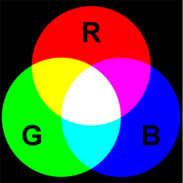
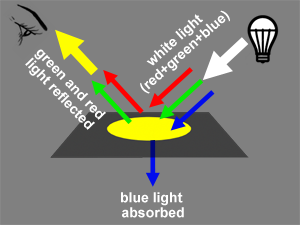
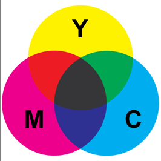
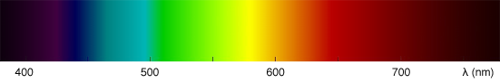
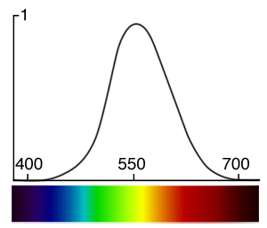
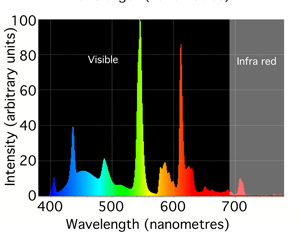
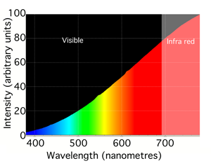
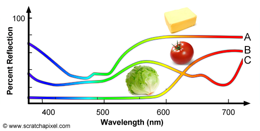
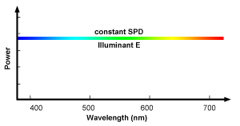

# 颜色和颜色空间之颜色

白色代表学术诚实和肉体之爱的纯净；红色代表艺术激情、政治信念、血气之勇；蓝色代表在音乐和数学上的内省发现、医疗助人以及万物的基本结构；翠绿代表和自然共鸣、和技术同乐以及对受威胁生命的保护；黑色代表人类神秘的创作，这是德姆・瑞亚的民族颜色的含义。我喜欢蓝色，你喜欢绿色，人家喜欢黑色，这在日常颜色真的很简单，只需要感性的感受它的美就可以。但当我看到“颜色空间”，进而去想理解颜色的时候，发现我们对颜色的描述真的是很复杂，涉及到光的物理性质，以及的生理结构等方面。现记下对颜色学习的笔记。

## 什么是颜色
### 光
我们能看各种颜色的大千世界，一切都始于光。所要明白颜色是什么，我们先得明白光是什么东西。光有粒子性和波动性，但在研究颜色的问题上，都使用光的波动性来研究，即光是一种波，物理学上叫电磁波。由于有不同波长的电磁波，就产生不同颜色的光，比如蓝色光中光波的波长比红色光中光波的波长短些。
光波的波长用希腊字母 λ 表示，可见光的波长大概时380-740纳米，大于740纳米和小于380纳米的光波人类的眼睛就看不到了，比如紫外线或红外线，但有些动物的眼睛可以感知到。人类可见光谱如下：

白光是由所有可见光颜色组合而成的（牛顿使棱镜实验），所以拿可见光谱中所有的光，并按合适的比例进行混合就可造出白光。
### 人的睛眼
人的睛眼视网膜上有两类主要的光感细胞，视锥细胞 和 视杆细胞。

**[视锥细胞（cone cell ）](https://zh.wikipedia.org/wiki/视锥细胞)**：主要分布在视网膜中心，视锥细胞主要负责颜色识别，并且在相对较亮的光照下更能发挥作用。

**[视杆细胞（rod cells）](https://zh.wikipedia.org/wiki/视杆细胞)**：主要分布在视网膜边上，且较视锥细胞对光更敏感，几乎主要全部用于夜视力。

视锥细胞有三种（亲红，亲绿，亲蓝视色素），而且每一种都对特定的可见光范围敏感。这三种视锥细胞刚好大约分别对红色，绿色，和蓝色最为敏感，而这三种颜色也是计算机显示器构造颜色的三原色。所以说视锥细胞负责颜色识别（或者叫三原色识别）。

### 原色以及增减色原理

**原色有两种定义：**

**1. 红色，绿色，蓝色。**增色法中的原色，计算机或照明行业使用方法。
>因为上面提到的生理的原因（视锥细胞对红色，绿色，和蓝色最为敏感），因此使用红，绿，蓝作为三原色,这三种颜色是相互独立的，任何一种都不能使用其它二种颜色混合。使用此三原色按比例混合成其它的颜色。
>
>红色+绿色=黄色
>
>绿色+蓝色=青色
>
>红色+蓝色=品红
>
>红色+绿色+蓝色=白色
>
>黄色、青色、品红都是由两种及色相混合而成，所以它们又称相加二次色。
>
>

**2. 黄色，品红，青色。**减色法中的原色，绘画艺术方面使用此方法。
>在白光照射下，青色颜料能吸收红色而反射青色，黄色颜料吸收蓝色而反射黄色，品红颜料吸收绿色而反射品红
>如下图黄色的产生。白光（红+绿+蓝）照射黄色颜料，其中的蓝色光成份被吸收，反射回红和绿色成份的光，而红色光加绿色光我们的眼睛即感知为黄色。
>
>
>
>白色-红色=青色
>
>白色-绿色=品红
>
>白色-蓝色=黄色
>
>另外，如果把青色和黄色两种颜料混合，在白光照射下，由于颜料吸收了红色和蓝色，而反射了绿色，对于颜料的混合我们表示如下：

>颜料(黄色+青色)=白色-红色-蓝色=绿色

>颜料(品红+青色)=白色-红色-绿色=蓝色
>
>颜料(黄色+品红)=白色-绿色-蓝色=红色
>
>

资料:

[三原色光模式](https://zh.wikipedia.org/wiki/三原色光模式#RGB.E9.A2.9C.E8.89.B2.E6.A8.A1.E5.9E.8B.E7.90.86.E8.AE.BA.E4.B8.8E.E5.BA.94.E7.94.A8.E7.9A.84.E5.8E.86.E5.8F.B2)

[色彩原理](http://www.ebaomonthly.com/window/photo/lesson/color_01.htm)

### 颜色的亮度
人的眼睛感受颜色的亮度是不一样的，感受有些颜色会比别的颜色亮一些，比如我们会感觉蓝色暗些，而绿色最亮。一般来说在波长555纳米到560纳米之间的颜色，人类感觉最亮。如下图：

在用色相（Hue）, 饱和度（Saturation）, 和亮度（Lightness）描述颜色的时候，就需指定这种颜色的亮度。人类眼睛对可见光颜色的亮度感觉可以用光度函数（luminosity function）来描述：

### 光谱功率分布（Spectral Power Distribution）

**光谱图：**

我们周围的灯看起来都特别的白，但每一种灯都不可能等量的发出可见光谱中所有的光。荧光灯发出发出的大部分颜色的光是差不多的，但有几个波段的光特别的强。白炽灯强列的发出所有颜色的光，波长越长越强烈（这是为什么白炽灯看起起偏黄的原因），而且有大部分超出了可见光的部分，也就是产生大量的红外线。这也是为什么白炽灯会浪费电的原因。

 

每一灯的的颜色成份都是独一无二的，就像人的指纹一样，这叫灯的光谱图或光谱功率分布Spectral Power Distribution（SPD）。

**白然光：** 因为我们地球就靠太阳照亮的，太阳光我们也称之为白然光（natural lighting），所以太阳的光谱图是一个特别的光谱图。因为我们眼睛经过了千万年去适应太阳光，所以如果我们造的灯的光谱能接近太阳光的光谱，我们就可以说这灯叫自然光灯，质量特别好。如果灯能一直发出类似太阳光谱的的灯，它这灯就可以叫做太阳灯了。

**D65:** 但是太阳光光谱的测定受各种因素的影响，比如我在北极测，他在喜马拉雅测，他在太平洋中央测，你在下雨天测，这样每个人测出来的太阳光光谱肯定是不一样的，这样人们对太阳光的定义就不一样了。所以国际照明委员会（International Commission on Illumination）定义了一个标准叫**D65**，符合欧洲、太平洋周边地区视觉颜色标准，模拟平均北天空日光，这标准大概就是北欧天气好的时候太阳光的样子。D65也叫标准日光光谱。
>*ICE 还定义了其它标准比如 D50, D75等，有兴趣可看看 [主要标准光源资料](https://en.wikipedia.org/wiki/Standard_illuminant)*

#### 物体的SDP
不仅是发光物体有独有颜色光谱曲线，不会发光的物体也有独一无二的光谱反射率曲线(spectral reflectance curve)。因为不发光的物体不发光，它会吸收部分照射它的光，并反射回未吸收的那部分，这部也会被我们看到。每一个物体都有其特别的光谱反射率曲线。如下为A（黄油），B(西红柿)，C（大白菜）的光谱反射率曲线：

 

国际照明委员会也定义了一个非常有用的标准 **显色指数（Color Rendering Index）**：光源对物体的显色能力称为显色性，是通过与同色温的参考或基准光源（白炽灯或画光）下物体外观颜色的比较。

>色温
>色温有时候会用来描述颜色，就像我们会蓝色比黄色冷。这个名词原本描述的现象是，当一个物体的温度达到一定值会发出可见光，而这可见光的颜色取决于这个物体温度的大小。这个现象叫黑体辐射。太阳可看成一个黑体，它的温度大概是5700K。

### 什么是白色？
当可见光谱中所有成份的光都等量时，就是标准的白色。这种光源在现实之中是不存在的，那的光谱图叫**E标准光源(E illuminant)**,对应ICE标准光源中的E光源。

学习资料：

[Scratchapixel: Introduction to Light, Color and Color Space](http://www.scratchapixel.com/lessons/digital-imaging/colors/introduction)

[Apple: Color: A Brief Overview](https://developer.apple.com/library/content/documentation/GraphicsImaging/Conceptual/csintro/csintro_ovrvw/csintro_ovrvw.html#//apple_ref/doc/uid/TP30001148-CH205-BBCBDGDD)