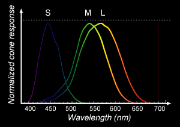
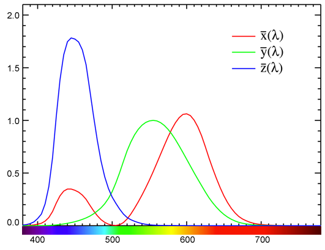
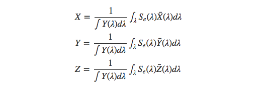
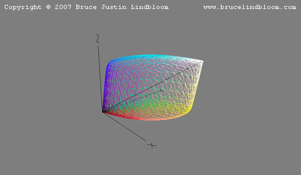
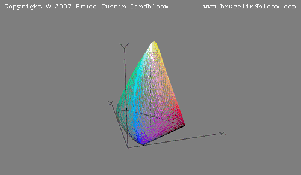

在[颜色和颜色空间这颜色]()说明了，我们看到物体的颜色或光的颜色，是由许多不同的波长（颜色）的光混合在一起的，可用光谱功率分布（Spectral Power Distribution）来描述，这样每一种颜色都可以用一个光谱功率分布图来描述。

但这种描述太复杂了，可见光谱中的每一种颜色都需要考虑，谁去测量SPD图啊。所以就有了其它更好的的描述方法，像用人类的语言，如：海棠红 樱桃色 大红 棕黄 碧绿 靛蓝 藏青 绛紫等等，其实这也是一种颜色空间。在平常交流中用起来特别方便，但也只限于日常或文字交流。需要更多其它可将颜色数字化的方法。

## 什么是颜色空间
**色域（Color Gamut）：** 一个系统所能产生，感知或描述的所有颜色的集合。如一种显示器系统，人眼视觉系统，或一种颜色模型，都有对应的色域。

**人类视觉系统色域**： 人类视觉系统所能感知到的所有的颜色。

**颜色空间：** 颜色空间是一种描述颜色的模型，这个模型尽可能多的描述人类视觉系统色域中的颜色。

>如RGB颜色空间，它使用三个分量R(Red:红)、G(Green:绿)、B(Blue:蓝)描述颜色，即利用这三种颜色进行混合而产生不同的颜色。所以RGB颜色空间所能表达的所有的颜色，可放入进一个立方体中，每一个点对应一种颜色，每一种颜色的数学表达就是三个基色分量。但这个立方体的颜色没有包含人类所能感知到的所有颜色。

大部分情况下颜色空间都不能完全包含人类视觉系统色域中的所有颜色，所大部分颜色空间的色域都是人类视觉系统色域的子集。有一个理想的颜色模型可以描述所有的颜色 **CIE XYZ 颜色模型**，它的色域如下图（这个图是xyY 颜色空间图，但用来表示XYZ 颜色模型的色域）：


### CIE XYZ 颜色空间

CIE XYZ 颜色模型，这个颜色模型是其它所有颜色模型的基础，包括计算机显示中常用的RGB颜色模型。这样可以将光谱功率分值转换成RGB三个颜色参数，直接反应人眼感受颜色的方式。

#### 标准色度观察者匹配函数
上面那个图怎么来的呢？

这个图开始于人的眼睛，不知道什么时候人们发现人眼的视锥视锥细胞有三种（L亲红，M亲绿，S亲蓝细胞），这三种视锥细胞刚好分别对红色，绿色，和蓝色最为敏感。人们就做实验测量了一下这三种细胞对不同波长（颜色）光的敏感程序。测试的结果图（如下图），发现这三种细胞分别接近对蓝色，绿色和红色敏感。



根据这个实现结果，CIE的科学家们就觉得所有的颜色是可以用特定的红，绿，蓝三原色混合（如增色法）而得到的。根据这个结论呢，科学家们又开始实验了，他们使用纯红，纯绿和纯蓝色来合成人能看到的所有颜色。实验可能是这样子的，他们叫来很多人，都坐在屏幕的中央线上（因为角度太大可能影响人们对颜色的识辨）。然后他们拿出人类的可见光谱来，在其中取一个颜色，比如竹青色，投到屏幕的右边，在屏幕的右边他们用不同量的红，绿，蓝合成竹青色。他们不断调整这三颜色光的比例，并且问当他们叫来的那些人觉不觉得屏幕左右两边的颜色是一样的，当下边的人们都觉得两边的颜色都是一样的竹青色的时候，他就记下红，绿，蓝光的值，这三个色值就可以合成竹青色。当CIE的科学家们把人类的可见光谱都测试完之后，得到得一张曲线图，这曲线图告诉我们这些颜色都可以多少比例的红，绿，蓝合成，叫 **标准色度观察者匹配函数** 也叫为光谱三刺激值，如下图：

>1931年国际照明委员会（CIE）规定，红、绿、蓝三种原色光的波长分别为：700nm、546.1nm、435.8nm。 



>注意绿色的曲线和光度函数（luminosity function）特别相似，光度函数曲线反应的是人的眼睛对颜色亮度的感觉，如见上一篇[颜色和颜色空间之颜色]()中的描述

这个图将每一个颜色SPD描述转成了，三色基色视觉系统表述：对应的[CIE 标准色度观察者匹配函数](http://www.cvrl.org/ciexyzpr.htm)根据需要下载。

根据这个实验数据，我们就可以用公式将对应的颜色转换成三个变量（X,Y,Z）去表示任何一种颜色。对应的公式如下：



>其中Se(λ)表示是的光辐射强度。比如发光的发射对应光的强度，或物体反应光的强度。

这样我们就可以得到每一种颜色对应的X,Y,Z分量值（因数据为非线性，可根据精度取对应的值，如每隔 5 nm取一个值），这样我们就可以根据对应的值绘出XYZ颜色空间的立体图。如下



### CIE xyY颜色空间
CIE xyY颜色空间是从CIE XYZ 颜色空间衍生出来的。其中xyz的计算如下：

>x=X/(X+Y+Z)
>
>y=Y/(X+Y+Z)
>
>z=Z/(X+Y+Z)
>
>其中X，Y，Z为CIE XYZ 颜色空间中的值

xyY颜色空间将色品（chromaticity）和亮度（brightness）独立出来，使用两个变量(x和y)来表示色品，保留XYZ颜色空间中的Y值来表示表示亮度（Y值曲线和人的眼睛对不同颜色亮度的感觉曲线特别相似）。

>白色和灰色有相同的色品，但有不同的亮度。
>
经过上面公式的归一化之后，x+y+z 的值就为1,这样就可以根据其中的两个值而计算出第三个值，如z=1−x−y。这样就两以使用x和y两个变量去变示颜色，就可以将应的色域绘制在二维坐标上面，即在开头的看到的色域图：


如果要将对应的Y也绘制出来，对应的三维图为：




### 灰度颜色空间

### RGB 颜色空间

标准色度观察者匹配函数

这个模型是由真实的人眼颜色匹配实验得出的模型，RGB分别表示那三个固定波长的光的份量。


### CMYK 颜色空间

## 颜色管理系统（Color Management Systems）
### 颜色空间转换
### 设备颜色Profiles文件
### 颜色管理组件（CMM）


相关资料：

[颜色空间总结](http://blog.csdn.net/lg1259156776/article/details/48317339)

[Color space](https://en.wikipedia.org/wiki/Color_space 'en.wikipedia.org')

[深入理解color model(颜色模型)](http://www.jianshu.com/p/f03e9ac9c9ef 'https://blog.ibireme.com/2013/08/12/color-model/')

专业介绍颜色：
[Introduction to Light, Color and Color Space](http://www.scratchapixel.com/lessons/digital-imaging/colors/color-space?url=digital-imaging/colors/color-space)

苹果官方文档: [Introduction to Color Management Overview](https://developer.apple.com/library/content/documentation/GraphicsImaging/Conceptual/csintro/csintro_intro/csintro_intro.html)

[Cocoa Drawing Guide学习part3——颜色AND透明](http://blog.noark9.com/2014/01/28/cocoa-drawing-guide-study-part-3/)

One of the best guides to code-level color management I've ever seen, especially online... You guys are awesome!!":
[Learn Computer Graphics From Scratch](http://www.scratchapixel.com/index.php?redirect)

#### 相关机构
[CIE 国际照明委员会(International Commission on Illumination)](http://www.cie.co.at/index.php/Research+Strategy?service=restart)

国际色彩联盟（International Color Consortium）的色彩管理的标准——ICC规范：
[国际色彩联盟](http://www.color.org/index.xalter)

// 颜色描述，计算，理解及颜色转换的数公式等
[Bruce Justin Lindbloom](URL: http://www.brucelindbloom.com)

#### HSV 和 HLS 颜色空间的描述：

这两个颜色空间使用三个变量描述颜色，分别是：色相（Hue）, 饱和度（Saturation）, 和亮度（Brightness）

* 色相：代表色谱中一种颜色，每一个色相都是标准的，独一无二的。比如蓝色，只有一种色相代表蓝色，区别于其它的颜色。
* 饱和度：即颜色的纯度（或浓淡）。如灰色即为0饱和度。
* 亮度：颜色的亮度。可理解为这种颜色物体反射或发出光的强度。如在夜里拿白色手电照射对应颜色，对应手电光的强度。


### 上下文件中如果使用 不同颜色空间图片 的渲染问题

```
void CGContextSetRenderingIntent ( CGContextRef context, CGColorRenderingIntent intent );

参数： intent：渲染意图的常量：kCGRenderingIntentDefault, kCGRenderingIntentAbsoluteColorimetric, kCGRenderingIntentRelativeColorimetric, kCGRenderingIntentPerceptual, or kCGRenderingIntentSaturation.
```
**Discussion：**渲染意图指明了Quartz应该如何去处理上下文中那些不在目的源颜色空间得颜色。如果你没有明确的设置渲染意图，Quartz使用 kCGRenderingIntentPerceptual,的渲染意图去绘制图片，kCGRenderingIntentRelativeColorimetric去进行其他的绘制。