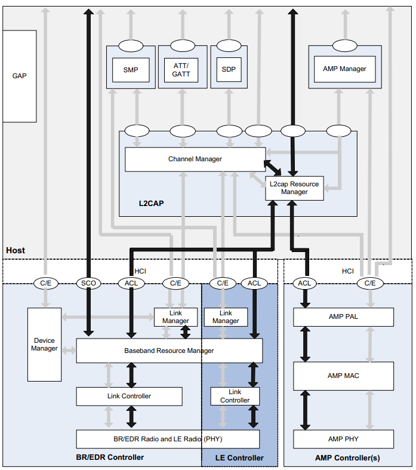

# 蓝牙协议栈-包分析

## 蓝牙

蓝牙是一种短距离的无线通信技术，因其可靠性、低功耗、低成本特性已广泛应用各种终端产品。

蓝牙有两种蓝牙技术，经典蓝牙-Basic Rate (BR) 和低功耗蓝牙技术-Low Energy (LE)。低功耗蓝牙技术是在2010年发布蓝牙4.0之后引入的。

* 低功耗蓝牙应用在可穿戴设备，IoT智能设备，健身设备，蓝牙鼠标键盘等电池供电场合
* 经典蓝牙主要应用在蓝牙电话接听，蓝牙耳机，蓝牙音箱等场合

> 在蓝牙4.0规格中，SIG定义了四种蓝牙controller技术：BR，EDR，AMP和LE，也就是说，蓝牙只有一种蓝牙，那就是SIG的蓝牙，而蓝牙技术本身包含四种类型：BR，EDR，AMP和LE。

低功耗蓝牙设备和经典蓝牙设备两者之间是不能相互通信的，但有双模蓝牙系统，即包含低功耗和经典蓝牙模块的系统。

蓝牙技术联盟（Bluetooth Special Interest Group，简称SIG）维护着蓝牙核心规范

* There are two forms of Bluetooth wireless technology systems: Basic Rate (BR) and Low Energy (LE). 
* The Bluetooth core system consists of a Host and one or more Controllers. A Host is a logical entity defined as all of the layers below the non-core profiles and above the Host Controller interface (HCI). A Controller is a logical entity defined as all of the layers below HCI. An implementation of the Host and Controller may contain the respective parts of the HCI.
* One device provides the synchronization reference and is known as the Central. All other devices synchronized to a Central’s clock and frequency hopping pattern are known as Peripherals. 

## 蓝牙核心系统

蓝牙核心系统由两个逻辑实体Host&Controller组成，一个Host对应一个或者多个Controller，Host和Controller之间通过HCI接口层交互。Controller对应两种类型：Primary Controllers 和Secondary Controllers。通常来说Primary Controllers只有一个，Secondary Controllers可能有多个，如AMP Controller。

在双芯片模式中，一般host跑在AP芯片上，页controller则跑在蓝牙模块上，两者之间通过HCI协议进行通信。

### 逻辑实体 Host
Host是蓝牙协议栈的核心部分。其中包含GAP,GATT, SM，L2CAP等协议的实现。包含制定设备工作状态，广播，连接，通道的多路复用，数据的分割重组，重传，流控机制等等的协议实现。

### 逻辑实体 Controller
Controller实现射频相关的模拟和数字部分，完成最基本的数据发送和接收，Controller对外接口是天线，对内接口是主机控制器接口HCI（Hostcontroller interface）；控制器包含物理层PHY（physicallayer），链路层LL（linker layer），直接测试模式DTM（Direct Test mode）以及主机控制器接口HCI。

* 对于BR/EDR 蓝牙设备类型，Controller通常包含 无线电处理、基带、链路管理、和可选择的HCI接口层；
* 对应LE Controller主要包含LE PHY、链路层、和可选择的HCI；
* 通常来说我们还可以合并BR/EDR Controller 和LE Controller到一个Controller，也就是我们常说的双模蓝牙。


## 蓝牙协议栈

Host是蓝牙协议栈的核心实现部分，是应用层开发主要熟悉部分。Controller有对Host控制器接口HCI（Hostcontroller interface）的实现。

蓝牙协议栈结构：



如上图所示：

Controller

* LinkManager、LinkController、BR/EDR Radio组成 BR/EDR Controller;
* AMP PAL 、AMP MAC、 AMP PHY 组成AMP Controller;
* Link Manager,Link Controller、LE Radio 组成 LE Controller；

Host

* L2CAP、SDP、GAP 组成 BR/EDR Host；
* L2CAP、SMP、Attribute protocol、GAP GATT组成LE Host；

### BLE蓝牙协议栈

<table cellspacing="0" class="t_table"><tbody><tr><td rowspan="8" width="85">&nbsp;&nbsp;<div align="center">BLE协议</div>&nbsp;&nbsp;</td><td colspan="2" rowspan="2" width="265"><div align="left"><div align="center">Bluetooth Application</div></div></td><td width="293"><div align="left"><div align="center">Applications</div></div></td></tr><tr><td width="293"><div align="right"><div align="center">GATT-Based Profiles/Services</div></div></td></tr><tr><td rowspan="6" width="113"><div align="right"><div align="center">Bluetooth Core</div>&nbsp;&nbsp;<div align="center">（Stack）</div></div></td><td rowspan="3" width="151"><div align="right"><div align="center">BLE Host</div></div></td><td width="293"><div align="right"><div align="center">ATT、GATT、SM</div></div></td></tr><tr><td width="293"><div align="right"><div align="center">GAP</div></div></td></tr><tr><td width="293"><div align="right"><div align="center">L2CAP</div></div></td></tr><tr><td colspan="2" width="444"><div align="right"><div align="center">HCI（对蓝牙协议无影响）</div></div></td></tr><tr><td rowspan="2" width="151"><div align="right"><div align="center">BLE Controller</div></div></td><td width="293"><div align="right"><div align="center">Link Layer</div></div></td></tr><tr><td width="293"><div align="right"><div align="center">Physical Layer</div></div></td></tr></tbody></table>

HCI 的全称是 Host Control Interface（主机控制接口），是蓝牙联盟定义规范的蓝牙协议层中的其中一层

### HCI数据包通常分为四种数据类型：

1. 命令包 HCI Command Packet 0x01;
2. ACL数据包 HCI ACL Data Packets 0x02;
3. 同步数据包 HCI Synchronous Data Packets 0x03;
4. 事件包 HCI Event Packet  0x04;
5. HCI ISO Data packet 0x05;

#### 命令包 HCI Command Packet 分析

 HCI Command Packet主要功能有：

* 配置控制器状态
* 请求执行特定的操作
* 管理连接


Command前有2字节的头部OpCode，用来表示是哪一个Command。


* OGF表示`OpCode Group Field`，即“哪一组命令”，它占据高6位。OGF Range (6 bits): 0x00 to 0x3F (0x3F reserved for vendor-specific debug commands)

* OCF表示`OpCode Command Field`，即“这组里的哪一个命令”，它占据低10位。OCF Range (10 bits): 0x0000 to 0x03FF

OGF:

	Link Control Commands: 1
	Link Policy Commands: 2
	Controller and Baseband Commands: 3
	Informational Parameters: 4
	Status Parameters: 5
	Testing Commands: 6
	LE Only Commands: 8

对应的组合表解释如下表：

| BT Commands for LE | OGF | OCF | Opcode |
| ------- | --- | --- | --- |
| LE Set Event Mask | 8 | 1 | 0x2001 |
| LE Read Buffer Size | 8 | 2 | 0x2002 |
| LE Read Local Supported Features | 8 | 3 | 0x2003 |
| LE Set Random Address | 8 | 5 | 0x2005 |
| LE Set Advertising Parameters | 8 | 6 | 0x2006 |
| LE Read Advertising Channel TX Power | 8 | 7 | 0x2007 |
| LE Set Advertising Data | 8 | 8 | 0x2008 |
| LE Set Scan Response Data | 8 | 9 | 0x2009 |
| LE Set Advertise Enable | 8 | 10 | 0x200A |
| LE Set Scan Parameters | 8 | 11 | 0x200B |
| LE Set Scan Enable | 8 | 12 | 0x200C |
| LE Create Connection | 8 | 13 | 0x200D |
| LE Create Connection Cancel | 8 | 14 | 0x200E |
| LE Read White List Size | 8 | 15 | 0x200F |
| LE Clear White List | 8 | 16 | 0x2010 |
| LE Add Device To White List | 8 | 17 | 0x2011 |
| LE Remove Device From White List | 8 | 18 | 0x2012 |
| LE Connection Update | 8 | 19 | 0x2013 |
| LE Set Host Channel Classification | 8 | 20 | 0x2014 |
| LE Read Channel Map | 8 | 21 | 0x2015 |
| LE Read Remote Used Features | 8 | 22 | 0x2016 |
| LE Encrypt | 8 | 23 | 0x2017 |
| LE Rand | 8 | 24 | 0x2018 |
| LE Start Encryption | 8 | 25 | 0x2019 |
| LE Long Term Key Requested Reply | 8 | 26 | 0x201A |
| LE Long Term Key Requested Negative Reply | 8 | 27 | 0x201B |
| LE Read Supported States | 8 | 28 | 0x201C |
| LE Receiver Test | 8 | 29 | 0x201D |
| LE Transmitter Test (max TX power for CC2541 is 0 dBm) | 8 | 30 | 0x201E |
| LE Test End Command | 8 | 31 | 0x201F |
| LE Remote Connection Parameter Request Reply | 8 | 32 | 0x2020 |
| LE Remote Connection Parameter Request Negative Reply | 8 | 33 | 0x20 |
| Disconnect | 1 | 6 | 0x0406 |
| Read Remote Version Information | 1 | 29 | 0x041D |
| Set Event Mask | 3 | 1 | 0x0C01 |
| Reset | 3 | 3 | 0x0C03 |
| Read Transmit Power Level | 3 | 45 | 0x0C2D |
| Set Controller To Host Flow Control (optional) | 3 | 49 | 0x0C31 |
| Host Buffer Size (optional) | 3 | 51 | 0x0C33 |
| Host Number Of Completed Packets (optional) | 3 | 53 | 0x0C35 |
| Set Event Mask Page 2 | 3 | 63 | 0x0C63 |
| Read Authenticated Payload Timeout | 4 | 123 | 0x0C7B |
| Write Authenticated Payload Timeout | 4 | 124 | 0x0C7C |
| Read Local Version Information | 4 | 1 | 0x1001 |
| Read Local Supported Commands (optional) | 4 | 2 | 0x1002 |
| Read Local Supported Features | 4 | 3 | 0x1003 |
| Read BD_ADDR | 4 | 9 | 0x1009 |
| Read RSSI | 5 | 5 | 0x1405 |

#### HCI层跟LL层的关系

* 有些HCI command只是用来设置本地Controller，不导致无线传输
* 有些HCI command会导致LL层发出各类广播包
	* 如Opcode 为 0x200C：LE Set Scan Enable，在主动扫描时会导致LL层发出SCAN_REQ广播包
	* 比如Opcode 为 0x200D：LE Create Connection Command 会导致LL层发出CONNECT_REQ广播包
* 有些HCI command会导致LL层发出数据包，其中的LLID=11b，表示是“LL Control PDU”
*  ACL Data是必定导致LL层发数据给对端设备的

具体Event各解释信息见 [7.7. Events](https://www.bluetooth.com/wp-content/uploads/Files/Specification/HTML/Core-54/out/en/host-controller-interface/host-controller-interface-functional-specification.html#UUID-d21276b6-83d0-cbc3-8295-6ff23b70a0c5)

####  事件包 HCI Event 分析

HCI Event主要有三种：

* Command Status Event: 命令状态事件, 表示控制器已经接收到命令并正在处理
* Command Complete Event: 命令完成事件, 表示命令已经处理完毕并返回结果
* Command Report Event: 广播上报事件，本Event是Controller主动上报的,不像上面两个类型的Event，都是由command导致的

事件会根据不同的命令触发：

* 对于不涉及连接的命令，可以立即得到执行结果，执行完毕事件报告该命令执行成功或失败。

* 对于涉及连接的命令，无法立即得到执行结果，命令执行完毕后，先返回执行完毕事件，等命令最终结果产生，再返回新的执行完毕事件。比如LE Create Connection Command命令，执行命令时先返回执行完毕，表面链路层开始执行或加入执行队列，待两端设备建立连接，将返回连接完成事件。

* 部分读命令，比如LE Read Advertising Channel Tx Power Command，执行完毕后将读取结果存放在状态信息事件中返回。

HCI事件包括BLE专有事件和通用事件，通用事件适用于经典蓝牙和BLE。BLE专有事件称为“元事件（LE Meta Event）”，共有20个，它们的事件代码均为0x3E，事件参数的第一个字节为Subevent_code，用以区分不同的元事件。如下：

| 事件 | Event Code | Subevent_Code | 描述 |
| ------ | --- | --- | ------ |
| LE Connection Complete Event | 0x3E | 0x01 | 建立连接完毕 |
| LE Advertising Report Event | 0x3E | 0x02 | 检测到广播数据或收到扫描响应数据 |
| LE Connection Update Complete Event | 0x3E | 0x03 | 连接参数更新完毕 |
| LE Read Remote Features Complete Event | 0x3E | 0x04 | 读取对端设备功能完毕 |
| LE Long Term Key Request Event | 0x3E | 0x05 | 控制器向主机发送LTK以加密链接 |
| LE Remote Connection Parameter Request Event | 0x3E | 0x06 | 对端设备发起更新连接参数请求 |
| LE Data Length Change Event | 0x3E | 0x07 | 控制器通知主机链路层数据长度发生了更新 |
| LE Read Local P-256 Public Key Complete Event | 0x3E | 0x08 | 控制器通知主机P-256密钥生成完毕 |
| LE Generate DHKey Complete Event | 0x3E | 0x09 | 控制器通知主机椭圆加密算法密钥生成完毕 |
| LE Enhanced Connection Complete Event | 0x3E | 0x0A | 建立连接完毕（还支持扩展连接） |
| LE Directed Advertising Report Event | 0x3E | 0x0B | 检测到定向广播数据或扫描响应数据 |
| LE PHY Update Complete Event | 0x3E | 0x0C | 物理层更新完毕 |
| LE Extended Advertising Report Event | 0x3E | 0x0D | 检测到扩展广播数据或扫描响应数据 |
| LE Periodic Advertising Sync Established Event | 0x3E | 0x0E | 建立周期广播同步完毕 |
| LE Periodic Advertising Report Event | 0x3E | 0x0F | 检测到周期广播数据或扫描响应数据 |
| LE Periodic Advertising Sync Lost Event | 0x3E | 0x10 | 周期广播数据无法同步 |
| LE Scan Timeout Event | 0x3E | 0x11 | 扫描超时 |
| LE Advertising Set Terminated Event | 0x3E | 0x12 | 终止广播数据集事件 |
| LE Scan Request Received Event | 0x3E | 0x13 | 收到扫描请求 |
| LE Channel Selection Algorithm Event | 0x3E | 0x14 | 使用了信道选择算法 |

| BT Events | Event Code |
| ------ | --- |
| Disconnection Complete | 0x05 |
| Encryption Change | 0x08 |
| Read Remote Version Information Complete | 0x0C |
| Command Complete | 0x0E |
| Command Status | 0x0F |
| Hardware Error (optional) | 0x10 |
| Number Of Completed Packets | 0x13 |
| Data Buffer Overflow | 0x1A |
| Encryption Key Refresh Complete | 0x30 |
| LE Meta events | 0x3E |
| Authenticated Payload Timeout Expired | 0x57 |

具体Event各解释信息见 [7.7. Events](https://www.bluetooth.com/wp-content/uploads/Files/Specification/HTML/Core-54/out/en/host-controller-interface/host-controller-interface-functional-specification.html#UUID-d21276b6-83d0-cbc3-8295-6ff23b70a0c5)

[Section 7.7.65](https://www.bluetooth.com/wp-content/uploads/Files/Specification/HTML/Core-54/out/en/host-controller-interface/host-controller-interface-functional-specification.html#UUID-9bfbd351-a103-f197-b85f-ffd9dcc92872)中查看所有的Event Code信息。

HCI的解析详见文档：
[Part A. UART Transport Layer](https://www.bluetooth.com/wp-content/uploads/Files/Specification/HTML/Core-54/out/en/host-controller-interface/uart-transport-layer.html)

HCI包的解析详见文档：
[Part E. Host Controller Interface Functional Specification - HCI data formats](https://www.bluetooth.com/wp-content/uploads/Files/Specification/HTML/Core-54/out/en/host-controller-interface/host-controller-interface-functional-specification.html#UUID-8af7a4d8-7a08-0895-b041-fdf9e27d6508)

ATT包详解见文档：
[Attribute Protocol (ATT)](https://www.bluetooth.com/wp-content/uploads/Files/Specification/HTML/Core-54/out/en/host/attribute-protocol--att-.html)

### 当前断开代码

```

7.7.65.30. LE BIG Sync Lost event
Description:

The HCI_LE_BIG_Sync_Lost event indicates that the Controller has not received any PDUs on a BIG within the timeout period BIG_Sync_Timeout or the BIG has been terminated by the remote device.

The BIG_Handle parameter is used to identify the BIG. This parameter is provided by the Host in the HCI_LE_BIG_Create_Sync command.

The Reason parameter is used to indicate the reason why the synchronization was lost or terminated. If synchronization was terminated due to the Broadcaster terminating the BIG, the Reason parameter shall be set to the error code Remote User Terminated Connection (0x13). If synchronization was terminated due to a timeout, the Reason parameter shall be set to the error code Connection Timeout (0x08). If synchronization was terminated due to a MIC failure, the Reason parameter shall be set to the error code Connection Terminated due to MIC Failure (0x3D).

When the HCI_LE_BIG_Sync_Lost event occurs, the Controller shall remove the connection handle(s) and data paths of all BIS(s) in the BIG with which the Controller was synchronized.

```

"BIG" 在蓝牙技术中代表"Broadcast Isochronous Group"，即广播等时组。这是指蓝牙5.1版本中引入的一种新特性，用于支持在蓝牙低功耗（BLE）广播通信中的同步传输。BIG允许多个从设备在同一时间间隔内同步接收来自主设备的数据，提高了数据传输的效率和可靠性。

`HCI_LE_BIG_Sync_Lost`事件通常在蓝牙低功耗（BLE）通信中出现，表示控制器在BIG中未收到任何PDU（Protocol Data Unit）或BIG已被远程设备终止。这可能是由于连接超时、远程设备终止连接或MIC（Message Integrity Code）校验失败等原因导致的。当控制器检测到这种情况时，会触发`HCI_LE_BIG_Sync_Lost`事件，并相应地处理失去同步的情况。


详见[7.7.65.30. LE BIG Sync Lost event](https://www.bluetooth.com/wp-content/uploads/Files/Specification/HTML/Core-54/out/en/host-controller-interface/host-controller-interface-functional-specification.html#UUID-9bfbd351-a103-f197-b85f-ffd9dcc92872)


HCI包解析示例：


物理层（Physical Layer）是BLE协议栈最底层，它规定了BLE通信的基础射频参数，包括信号频率、调制方案等。
BLE工作频率是2.4GHz，它使用GFSK频率调制，并使用跳频机制来解决频道拥挤问题。
BLE 5的物理层有三种实现方案，分别是1M Sym/s的无编码物理层、2M Sym/s的无编码物理层和1M Sym/s的编码物理层。其中1M Sym/s的无编码物理层与BLE v4系列协议的物理层兼容，另外两种物理层则分别扩展了通信速率和通信距离。


链路层LL（Link Layer）是协议栈中最重要的一层。
链路层的核心是状态机，包含广播、扫描、发起和连接等几种状态，围绕这几种状态，BLE设备可以执行广播和连接等操作，链路层定义了在各种状态下的数据包格式、时序规范和接口协议。

对于广播行为，链路层根据其可连接性，可扫描性，定向性三个维度定义了多种不同类型广播事件，相应的扫描行为和连接行为根据广播包的类型区分处理。连接过程涉及复杂的时序过程，利用连接参数可以配置连接过程时序。

广播、扫描和连接各自具有白名单过滤机制，可以针对指定地址的设备进行操作。链路层提供了一些列控制规程，比如加密连接和数据长度更新等，上层协议可以利用这些规程控制链路层。
此外，链路层利用私有地址实现了隐私特性。


1.GAP(generic access profile) 管理连接、广播和发现以及安全验证。
2.GATT(generic access attribute profile) 通用属性配置文件(GATT)在属性协议(ATT)的基础上构建，为属性协议传输和存储数据建立了一些通用操作和框架。
3.ATT(attribute profile) ATT的唯一基础是属性，规范对设备的属性一系列操作，如 write、read、find info等。


a)CENTRAL(MASTER): GAP role，例如手机、平板或者电脑，查找正在广播的从设备，初始化连接、修改连接参数。
b)PERIPHERAL(SLAVER): GAP role, 一般是一个嵌入式设备，依靠电池并且比较省电的。
c)CLIENT:向另外一个设备(server)读取数据或者写入数据。一个设备可以既是client也是server。
d)SERVER: 提供数据给其他设备(client)。一个设备可以既是client也是server。

1)PROFILE: 规范了由一系列service构成的表现，如心率计等。
2)SERVICE：由特征值组成，和其他service组合描述了设备的具体行为能力。
3)CHARACTERISTIC: 特征值，包含user data 和metadata， 通过可读、可写、描述符来描述。
4)WRITE: 改变属性值的请求。
5)READ: 获取属性值的请求。
6)NOTIFICATION:发送给已注册的客户端提示某个属性值的改变，不需要应答。由server来初始这个动作。
7)INDICATION：和NOTIFICATION类似，但是需要应答。也是由server来初始化这个动作。

[[技术交流] 【蓝牙】小院闲聊#05#——蓝牙协议栈层次结构](http://bbs.lierda.com/forum.php?mod=viewthread&tid=9865&extra=page%3D16)

[[技术交流] 低功耗蓝牙ATT规格解读](http://bbs.lierda.com/forum.php?mod=viewthread&tid=11453&extra=page%3D8)

>
ATT，全称attribute protocol（数据交互协议）。说到底，ATT是由一群ATT命令组成，就是上文所述的request（请求）和response（响应）命令，ATT也是蓝牙空口包中的最上层，也就是说，ATT就是大家对蓝牙数据包进行分析的最多的地方。


[物联网开发者社区-蓝牙](https://bbs.lierda.com/forum.php?mod=forumdisplay&fid=55)

[第12节-BLE协议HCI层的数据格式](https://www.cnblogs.com/-glb/p/11617685.html)

[【蓝牙】小院闲聊#06#——ATT和GATT的概念](http://bbs.lierda.com/forum.php?mod=viewthread&tid=9867)

[[应用笔记] BLE低功耗蓝牙协议栈简述](http://bbs.lierda.com/forum.php?mod=viewthread&tid=13245&extra=page%3D3)


[蓝牙 BLE连接参数 连接间隔讲解](https://www.cnblogs.com/debugdabiaoge/p/16055963.html)