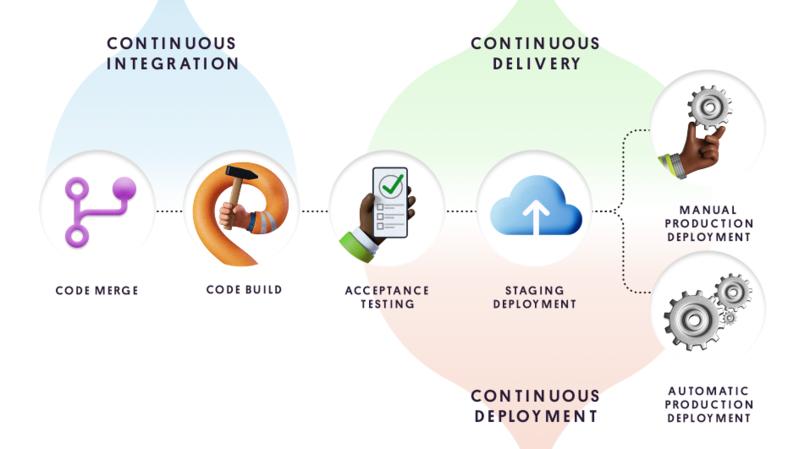
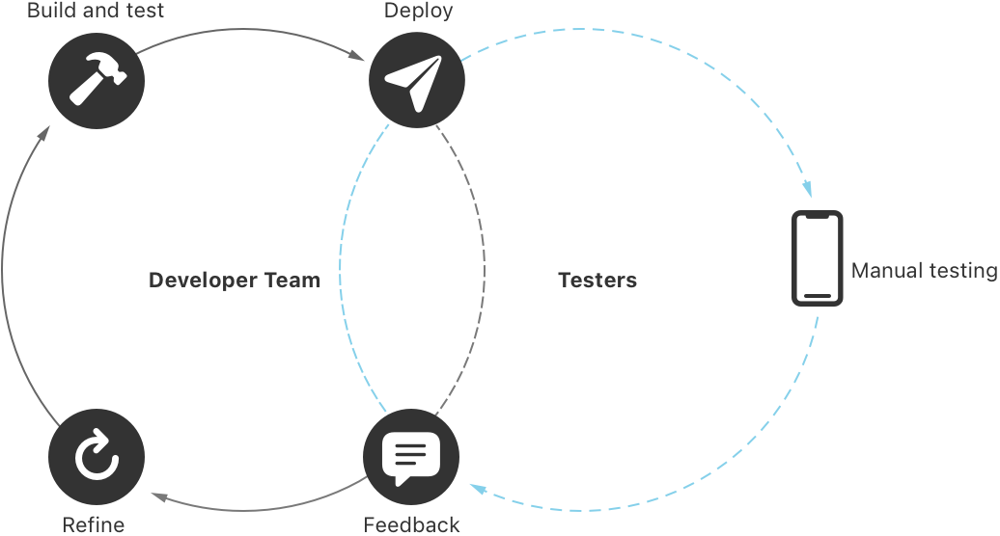

## CI/CD-持续集成/交付或部署

CI/CD(Continuous Integration/Continuous)，或持续集成/持续交付或部署，是一种采用自动化技术的软件开发实践。通过持续的代码交付，频繁可靠的更新加快了发布周期。

[引用自：unity.com](https://unity.com/cn/solutions/what-ci-cd#how-are-cicd-and-devops-related)

**CI: 持续集成(Continuous Integration)**

开发成员整合代码，并通过自动化构建（编译，自动化测试，代码分析）来快速发现问题。

* 编译打包-build
* 自动化测试-test Or Unit Test
* 代码分析-source code analysis
	
**CD: 持续交付或持续部署(Continuous Delivery or Continuous Deployment)**

**持续交付**：将App在测试平台自动化构建版本并发布测试

**持续部署**：将App自动化生成新版本，并上传到生产环境。

[Apple - About continuous integration and delivery](https://developer.apple.com/documentation/xcode/about-continuous-integration-and-delivery-with-xcode-cloud)