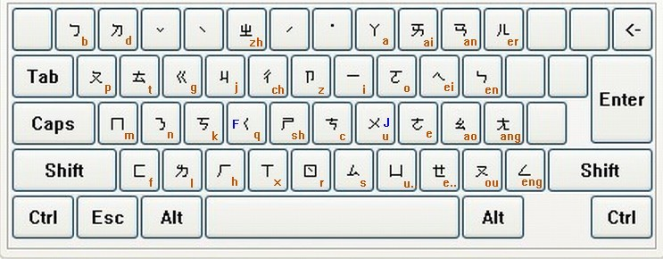

# 台湾注音输入法

●聲符(聲母)：ㄅ—b、ㄆ—p、ㄇ—m、ㄈ—f、ㄉ—d、ㄊ—t、ㄋ—n、ㄌ—l、ㄍ—g、ㄎ—k、ㄏ—h、ㄐ—j、ㄑ—q、ㄒ—x、ㄓ—zh(zhi)、ㄔ—ch(chi)、ㄕ—sh(shi)、ㄖ—r(ri)、ㄗ—z(zi)、ㄘ—c(ci)、ㄙ—s(si)

●韻符(韻母)：ㄚ—a、ㄛ—o、ㄜ—e、ㄝ—ê、ㄞ—ai、ㄟ—ei、ㄠ—ao、ㄡ—ou、ㄢ—an、ㄣ—en、ㄤ—ang、ㄥ—eng、ㄦ—er

●介符(介母)：ㄧ—i、ㄨ—u、ㄩ—ü

●結合韻：ㄧㄚ—ia、ㄧㄛ—io、ㄧㄝ—ie、ㄧㄞ—iai、ㄧㄠ—iao、ㄧㄡ—iou(iu)、ㄧㄢ—ian、ㄧㄣ—in、ㄧㄤ—iang、ㄧㄥ—ing、ㄨㄚ—ua、ㄨㄛ—uo、ㄨㄞ—uai、ㄨㄟ—uei(ui)、ㄨㄢ—uan、ㄨㄣ—uen(un)、ㄨㄤ—uang、ㄨㄥ—ueng[ong]、ㄩㄝ—üe、ㄩㄢ—üan、ㄩㄣ—ün、ㄩㄥ—iong

漢語拼音的特殊聲母：y(i 一)、w(u ㄨ)

[注音符號與拼音對照表](https://www.ifreesite.com/phonetic/phonetic.htm)

[注音-漢語拼音 對照表](http://www.erva.nl/zhuIn-hanIn.pdf)

#### 介绍说明
[一日一技 | 从这些记忆技巧开始，你也能学会注音输入法](https://sspai.com/post/75244)

[如何快速上手注音输入法｜一日一技](https://sspai.com/post/75103)

[重新认识拼音与发音：聊聊汉语拼音与注音符号方案的差异](https://sspai.com/post/75248)

#### 练习
[中打基本功](https://worldofkeyboards.com/bopomofo)

#### 工具

[在线繁体字转换工具](https://www.aies.cn)

[教育部-注音索引](https://dict.concised.moe.edu.tw/searchP.jsp?SN=ㄒ&SN2=ㄒㄧˊ&word=習&la=0&powerMode=0)

